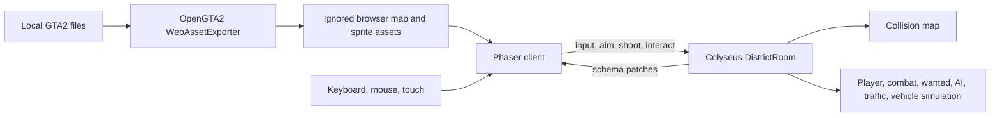
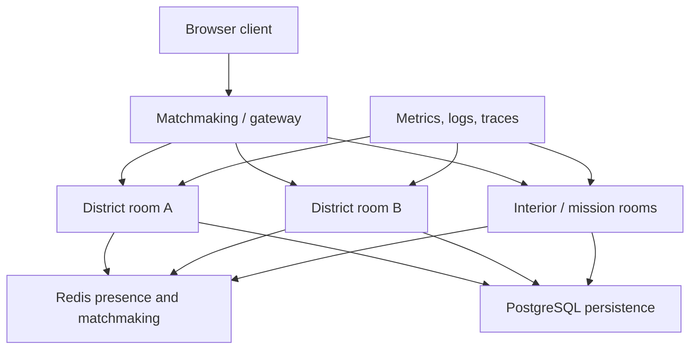
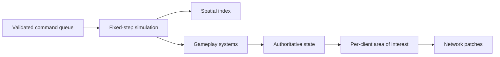

# NOCK0 Engineering Report

Date: 2026-07-10

## Executive Summary

NOCK0 is now a playable browser-based, top-down multiplayer crime sandbox rather than a Reldens customization. The project has a purpose-built Phaser client, an authoritative Colyseus server, and an offline OpenGTA2 conversion tool that reads a locally owned GTA2 installation.

The current slice proves the core experience:

- multiple browser players in one district;
- authoritative walking, aiming, weapons, bullets, damage, death, and respawn;
- wanted heat, police pursuit, police gunfire, civilians, and rewards;
- road-aware traffic, drivable cars, impacts, passengers, passenger gunfire, and hijacking;
- desktop and touch controls;
- layered GTA2 map rendering in which overhead wires and gantries do not block movement or bullets.

This is a strong prototype, not a production MMO. Its next constraint is architecture, not feature count. The two largest files, `server/district-room.ts` and `src/game/district-scene.ts`, already combine too many responsibilities. Runtime work is also global within one room: every client receives the district state and several collision or combat paths scan whole entity collections. Adding missions, businesses, interiors, inventory, audio, and more AI directly to these files would make development slower and runtime cost unpredictable.

The recommended direction is to preserve Colyseus and Phaser, modularize the simulation around one authoritative district per room, introduce spatial indexing and explicit entity budgets, and only then add persistence and horizontal room distribution.

The companion [`PROJECT_STRUCTURE.md`](PROJECT_STRUCTURE.md) turns this direction into concrete domain boundaries and extraction rules for refined pedestrian AI, driving AI, police, combat, missions, economy, client presentation, content, and testing.

## What Was Built

### Browser Client

- Full-screen Phaser 3 city scene with no MMORPG shell.
- GTA2-derived local map, pedestrian sheets, and vehicle sheet loaded at runtime.
- Client-side movement prediction with server correction.
- Interpolation for remote players, NPCs, bullets, and vehicles.
- Connected-player nameplates with overlap resolution.
- Player walk animation, held weapon models, muzzle flashes, damage feedback, and death screen.
- Pistol, SMG, and shotgun HUD with ammunition and mouse, keyboard, and touch controls.
- Vehicle entry prompts, driver speed HUD, and touch CAR control.
- Passenger upper-body peek and recoil animation with seat-aware weapon placement.
- Responsive desktop and mobile layouts.

### Authoritative Game Server

- One Colyseus `DistrictRoom`, currently capped at 32 clients.
- 30 Hz simulation and 20 Hz state patching.
- Server-owned player movement, collision, aim, weapon selection, ammunition, cooldowns, projectile speed, spread, damage, and rewards.
- Server-owned wanted heat, delayed decay, police targeting, line of sight, and police shooting.
- Civilian wandering, panic, death, and respawn.
- Road-graph traffic using GTA2 `Road` ground metadata.
- Player driving with acceleration, reverse, steering, wall response, and impact damage.
- Four seats per vehicle, passenger shooting, driver promotion, and occupant nameplates.
- Timed hijacking that brakes traffic, ejects an NPC driver, grants control, and records a crime.
- Full wanted reset on player respawn.

### GTA2 Conversion Pipeline

The sibling OpenGTA2 repository now includes `OpenGta2.WebExporter`. It:

- reads a local `.gmp` map and `.sty` style;
- selects a 64-by-64 district crop;
- exports a Tiled-compatible map and collision layer;
- exports an invisible road navigation layer from GTA2 ground types;
- separates street-level faces from elevated visual overlays;
- detects sparse overhead faces such as utility wires and gantries;
- creates browser PNGs for the map, overlay, pedestrians, police, and vehicles;
- writes metadata including spawn, walkable cell count, road cell count, and elevated passage count.

GTA2-derived outputs are ignored by Git. Only the converter and original NOCK0 assets belong in source control.

## Current Architecture



### Runtime Contract

The client sends intent, not trusted positions or damage. The room validates and simulates that intent, writes authoritative schema state, and Colyseus sends delta patches. This boundary is correct and should remain.

### Current Code Concentration

At this snapshot, server and client game code total roughly 3,100 lines. Two files contain most behavior:

- `server/district-room.ts`: roughly 900 lines;
- `src/game/district-scene.ts`: roughly 800 lines.

That concentration is acceptable for proving the slice, but it is the immediate development-scaling risk.

## Verification Completed

Automated tests currently cover:

1. two clients joining and receiving shared authoritative state;
2. weapon cycling and ammunition consumption;
3. passenger weapon selection, independent aim, and firing;
4. shared vehicle seating;
5. player driving and replicated movement;
6. PvP damage, death, reward, and respawn;
7. zero wanted heat after respawn;
8. eight traffic vehicles spawning and moving;
9. hijacking, driver ejection, crime heat, and control transfer;
10. safe spawn, map boundaries, road navigation, and elevated gantry traversal.

The TypeScript production build, converter release build, live health endpoint, and desktop/mobile browser layouts have also been verified.

## Honest Readiness Assessment

### Ready Now

- private browser playtesting;
- rapid iteration on combat and vehicle feel;
- testing local GTA2-compatible content conversion;
- multiplayer sessions with a small group in one district;
- replacing GTA2 art incrementally with original content.

### Not Ready Yet

- public hosting of GTA2-derived assets;
- persistent accounts, inventory, money, vehicles, or missions;
- reconnect-safe sessions;
- adversarial internet clients;
- large districts with hundreds of dynamic entities;
- multiple server processes or machines;
- seamless travel between districts;
- production monitoring, moderation, deployment, and rollback;
- a measured concurrency claim.

## Scaling Risks

### 1. The Room Is a Monolith

`DistrictRoom` owns connection lifecycle, input handling, simulation order, movement, combat, wanted heat, NPC AI, traffic, vehicles, seating, and hijacking. Any new system can accidentally change update order or shared state.

Required response: split behavior by system while keeping one room as the coordinator.

Suggested server modules:

```text
server/
  rooms/district-room.ts
  simulation/simulation.ts
  simulation/spatial-index.ts
  players/player-system.ts
  combat/combat-system.ts
  combat/weapon-catalog.ts
  vehicles/vehicle-system.ts
  vehicles/traffic-system.ts
  ai/pedestrian-system.ts
  ai/police-system.ts
  wanted/wanted-system.ts
  world/collision-map.ts
  world/road-graph.ts
  state/
  protocol/
```

Each system should expose a small update or command API and own its runtime-only maps. The room should establish simulation order and translate network messages into validated commands.

### 2. Global Entity Scans Will Become Expensive

Current bullets scan players and NPCs. Vehicle impacts scan NPCs and players. Police scan wanted players. Similar global scans will multiply as missions, pickups, shops, and more traffic are added.

Required response: add a uniform spatial hash before increasing entity counts.

- Use fixed world cells, initially 128 or 256 pixels wide.
- Index players, NPCs, vehicles, pickups, and relevant projectiles.
- Query neighboring cells for hits, impacts, police awareness, interaction prompts, and interest management.
- Update membership only when an entity crosses a cell boundary.
- Keep static tile collision separate from dynamic entity queries.

This changes common work from whole-district scans to nearby-entity scans and provides the same primitive needed for network area of interest.

### 3. Every Client Sees the Whole Room State

This works for the current crop and entity count. It will waste bandwidth and client work as the world grows.

Colyseus 0.16 provides per-client `StateView` filtering, but its documentation warns that it is not optimized for very large datasets. Use it for a bounded district area of interest, private fields, and level-of-detail selection, not as permission to create an unbounded room.

Recommended model:

- One room owns one bounded district or district shard.
- A spatial interest system maintains the nearby entities visible to each client.
- Persistent identity, inventory, and economy data stay outside transient room state.
- District transfers use explicit handoff points and reconnect the client to another room.
- Interiors can be separate rooms or small instances rather than always simulated in the street room.

Official references: [Colyseus rooms](https://docs.colyseus.io/room), [StateView](https://0-16-x.docs.colyseus.io/state/view).

### 4. One Room Still Runs on One Process

Colyseus distributes room instances across processes, but a single room belongs to one process. More processes increase the number of rooms the deployment can host; they do not divide one room's simulation across CPU cores.

This makes the district the important capacity boundary. We must benchmark the maximum useful players and entities per district rather than making a global CCU claim.

For multiple processes or machines:

- use a shared Redis Presence;
- use an external matchmaking driver such as Redis or PostgreSQL;
- expose game-server processes through the supported load-balancing topology;
- keep room ownership exclusive to one process;
- use pub/sub only for cross-room events that truly need it.

Official references: [Colyseus scalability](https://0-15-x.docs.colyseus.io/scalability/), [current driver documentation](https://docs.colyseus.io/server/driver).

### 5. Projectiles Can Create State and Bandwidth Spikes

Every bullet is currently a schema entity. A shotgun creates six. Higher weapon rates, many players, and ricochets would multiply allocations, collision checks, and patches.

Recommended progression:

1. Pool runtime projectile records and client render objects.
2. Put a hard per-player and per-room projectile budget in configuration.
3. Keep slow or gameplay-relevant projectiles in synchronized state.
4. Consider authoritative hitscan plus compact tracer messages for fast firearms.
5. Send damage and death as state, while using transient messages only for presentation events.

The choice should be measured against bandwidth and replay requirements, not made globally for every weapon.

### 6. AI and Traffic Need Budgets and Lifecycle Rules

Traffic follows road cells but does not yet include car-to-car avoidance, signals, lane reservation, or offscreen lifecycle management. Ejected NPC drivers can also accumulate through repeated hijacks.

Required controls:

- maximum active civilian, police, traffic, and ejected-driver counts;
- spawn and despawn policy based on player proximity;
- pooled NPC identities or cleanup after a timeout;
- precomputed road graph with lane direction and intersection metadata;
- low-frequency AI thinking separated from 30 Hz movement integration;
- path requests queued with per-tick work limits;
- deterministic fallback behavior when a path budget is exhausted.

### 7. Persistence Must Not Enter the Tick Loop

Use PostgreSQL as the durable source of truth for accounts and economy. Redis can support presence, matchmaking, short-lived session state, and carefully scoped locks, but it should not replace durable economic records.

Suggested durable model:

- account and character identity;
- inventory and weapon ownership;
- wallet plus append-only economy ledger;
- owned vehicles and customization;
- mission progress and cooldowns;
- property and business ownership;
- sanctions and moderation history.

Rules:

- never write position every simulation tick;
- load a character snapshot on authenticated join;
- persist meaningful checkpoints and transactional changes;
- use idempotency keys for rewards and purchases;
- use an outbox for events that must update multiple services;
- separate spendable balance changes from transient room cash presentation.

Colyseus is database agnostic and supports loading authenticated player data during room admission. Reference: [database and persistence](https://docs.colyseus.io/database).

### 8. Reconnection and Authentication Are Missing

Guest names in local storage are not identities. A public server needs:

- `onAuth` token validation;
- a stable account and character identifier distinct from a session ID;
- a bounded reconnection grace period;
- recovery of seat, vehicle, and combat state where appropriate;
- explicit behavior for disconnecting drivers and passengers;
- duplicate-login policy;
- server-side chat and name moderation.

Colyseus exposes reconnection tokens and room reconnection lifecycle hooks. Reference: [room lifecycle](https://docs.colyseus.io/room).

### 9. Input Abuse and Cheating Need Explicit Limits

Authoritative positions and damage are a good start, but a public client can still flood valid-looking commands.

Add:

- `maxMessagesPerSecond` at the room level;
- per-command token buckets for input, aim, shoot, interact, and chat;
- monotonically increasing input sequence numbers;
- normalized input validation and stale-command rejection;
- server-owned weapon randomness and inventory checks;
- impossible fire-angle and interaction-distance telemetry;
- audit events for economy, kills, and moderation actions.

The current Colyseus room API includes a message-rate limit that disconnects clients exceeding it. It should be a final guard, not the only per-command control. Reference: [room properties](https://docs.colyseus.io/room).

### 10. Client Rendering Needs System Boundaries and Pooling

`DistrictScene` currently owns loading, input, network synchronization, all render entity creation, interpolation, HUD updates, camera behavior, and effects.

Recommended client modules:

```text
src/game/
  district-scene.ts
  network/state-adapter.ts
  input/input-controller.ts
  rendering/player-renderer.ts
  rendering/vehicle-renderer.ts
  rendering/npc-renderer.ts
  rendering/projectile-renderer.ts
  rendering/effect-pool.ts
  ui/hud-controller.ts
  world/map-renderer.ts
```

Also add:

- projectile and effect object pools;
- camera-based render culling;
- interpolation buffers using server timestamps;
- one DOM reference cache rather than repeated queries;
- asset manifests with version hashes;
- graphics quality settings for mobile devices.

### 11. Content Must Become Data-Driven

Weapons are already centralized, but missions, vehicles, handling, NPC archetypes, shops, pickups, wanted responses, and districts must not become hard-coded branches.

Use versioned schemas for:

- weapon definitions;
- vehicle handling and seat layouts;
- NPC archetypes and spawn sets;
- police escalation tables;
- mission graphs and objective parameters;
- item and economy catalogs;
- district entrances, interiors, traffic lanes, and encounter zones.

Validate all content during CI and reject missing assets, invalid references, impossible spawn positions, or duplicate IDs.

### 12. Original Assets Are a Production Requirement

The local GTA2 pipeline is useful for compatibility testing and gameplay prototyping. It does not establish redistribution rights. Public hosting should use an original city, sprites, vehicle art, audio, names, UI, and branding, or assets with explicit licenses.

The converter should remain an optional developer tool. The production build should consume a generic versioned map contract that both the converter and an original Tiled-based pipeline can produce.

## Recommended Target Architecture



Within each district room:



## Development Roadmap

### Phase 0: Stabilize the Prototype

Goal: make additions predictable without changing gameplay.

- Split `DistrictRoom` and `DistrictScene` by system.
- Introduce shared protocol and content types.
- Add a spatial hash and entity lifecycle budgets.
- Replace `Date.now()`-driven gameplay randomness with a room clock and seeded RNG where determinism matters.
- Add input sequence numbers and message-rate limits.
- Add structured logs and tick-duration metrics.
- Cap and clean up ejected drivers and transient bullets.
- Add CI for tests, TypeScript build, converter build, and asset-contract validation.

Exit gate: no gameplay regression, no monolithic system ownership, and a repeatable baseline load report.

### Phase 1: Persistent Multiplayer Foundation

Goal: players can safely leave and return.

- Add account authentication and character IDs.
- Add PostgreSQL migrations and repositories.
- Add reconnection grace and duplicate-session handling.
- Persist inventory, wallet ledger, owned vehicles, and mission checkpoints.
- Add idempotent reward and purchase APIs.
- Add protected administration and moderation tools.

Exit gate: reconnect and restart tests prove that economic state cannot duplicate or disappear.

### Phase 2: District Capacity

Goal: determine and raise the real per-room limit.

- Add area of interest using the spatial index.
- Pool projectiles and effects.
- Add AI think-rate budgets and offscreen lifecycle rules.
- Add traffic lane metadata and basic vehicle avoidance.
- Run distributed load tests with realistic movement, shooting, driving, and reconnect behavior.
- Profile event-loop lag, garbage collection, patch bytes, and client frame time.

Initial benchmark scenario, not a capacity promise:

- 32 connected players;
- 100 active pedestrians and police;
- 40 traffic vehicles;
- a bounded burst of 200 projectiles;
- 30 Hz simulation with p99 tick work comfortably below the 33 ms tick budget;
- no unbounded growth during a multi-hour soak test.

Colyseus provides a load-test client, but its own documentation notes that large tests need multiple load-generator processes. Reference: [load testing](https://0-15-x.docs.colyseus.io/tools/loadtest/).

### Phase 3: Multi-Room World

Goal: scale total concurrency by adding district capacity horizontally.

- Add Redis Presence and an external matchmaking driver.
- Run multiple game-server processes behind the supported routing topology.
- Create district and interior room metadata.
- Implement safe district handoff and spawn continuity.
- Keep cross-room economy and social features in durable services, not duplicated room state.
- Evaluate the production transport only after profiling; Colyseus documents uWebSockets as the higher-performance production option.

Exit gate: players transfer districts without item loss, duplicate sessions, or stale vehicle ownership.

### Phase 4: GTA-Like World Systems

Goal: build depth on top of a stable platform.

- mission and objective framework;
- inventory, pickups, reloads, and weapon progression;
- vehicle health, destruction, repair, garages, and customization;
- police dispatch, roadblocks, arrests, and jail flow;
- businesses, properties, crews, and territory;
- chat, parties, friends, moderation, and reporting;
- original art, audio, animation, and map production pipeline.

## Observability Requirements

Before increasing room size, record at least:

- simulation tick duration p50, p95, and p99;
- event-loop lag and process memory;
- entities by type and room;
- incoming messages by type and client;
- rejected or rate-limited commands;
- patch bytes and messages per client;
- room joins, drops, reconnects, and transfer failures;
- database latency and transaction failures;
- client FPS, long frames, and asset-load failures.

The Colyseus monitoring panel is useful during development but exposes administrative control and must be protected in production. Reference: [monitoring panel](https://docs.colyseus.io/tools/monitoring).

## Architectural Decisions to Keep

- Keep the server authoritative.
- Keep Phaser for the browser client.
- Keep Colyseus rooms as bounded simulation units.
- Keep map conversion offline.
- Keep generated third-party assets out of Git.
- Keep state for durable current facts and use messages for transient presentation events.
- Prefer incremental system extraction over a rewrite.

## Immediate Next Five Engineering Tasks

1. Extract `CombatSystem`, `VehicleSystem`, `TrafficSystem`, `NpcSystem`, and `WantedSystem` from `DistrictRoom` without behavior changes.
2. Add a shared spatial hash and replace bullet, impact, interaction, and police global scans.
3. Introduce room-clock command timestamps, input sequence numbers, per-command rate limits, and deterministic tests.
4. Add entity caps and cleanup for bullets, traffic, civilians, police, and ejected drivers.
5. Create a repeatable Colyseus load-test scenario and capture the first tick, bandwidth, memory, and client-FPS baseline.

These tasks provide more leverage than adding another gameplay feature now. Once they are complete, missions, inventory, vehicle destruction, and a larger city can be added without compounding the prototype's current structural risks.
