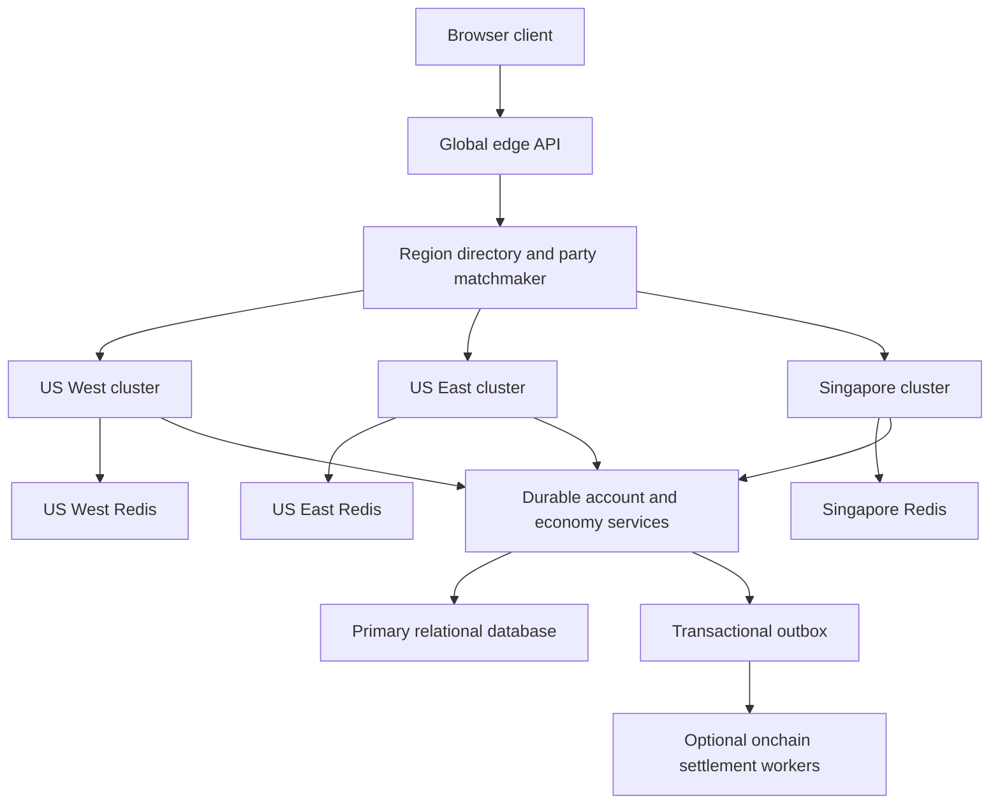
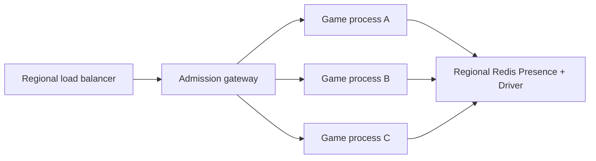

# Production Multiplayer Infrastructure Plan

Updated: 2026-07-11

## 1. Goals and Non-Negotiable Rules

NOCK0 is a server-authoritative browser game. Production infrastructure must preserve these rules:

1. One active district room has exactly one authoritative process in exactly one region.
2. Clients send input intent, never trusted position, damage, money, inventory, or mission results.
3. Regional placement reduces physical latency; prediction and reconciliation hide the latency that remains.
4. Persistent identity and economy are outside transient room state and outside the 30 Hz simulation.
5. Cross-region friendship is supported by choosing one fair host region for the group, not by running competing copies of the same room.
6. More processes increase the number of rooms. They do not divide one room across CPU cores.
7. Blockchain settlement is asynchronous and never enters matchmaking, room admission, or the simulation tick.

Initial production service-level objectives:

| Signal | Target | Hard warning |
| --- | ---: | ---: |
| Client-to-room RTT | p50 under 60 ms, p95 under 100 ms | above 150 ms |
| RTT jitter | p95 under 20 ms | above 40 ms |
| Simulation step | p95 under 16 ms, p99 under 25 ms | any sustained step above 33 ms |
| Event-loop delay | p95 under 10 ms, p99 under 25 ms | sustained p95 above 20 ms |
| State patch interval | 50 ms nominal | p95 delivery gap above 100 ms |
| Room WebSocket availability | 99.9% monthly | reconnect rate above 1%/minute |
| Room capacity | below 65% measured CPU/bandwidth ceiling | above 80% |

## 2. Regional Topology

Start with independent regional game clusters:

- `us-west`: California, serving western/central US and development access from Mexico.
- `us-east`: Virginia, serving eastern US.
- `asia-se`: Singapore, serving Southeast Asia.
- Later `asia-ne`: Tokyo, only when Japan/Korea concurrency justifies it.

Railway currently provides California, Virginia, Amsterdam, and Singapore. Use separate Railway services and explicit regional hostnames during the first production stage. Do not enable anonymous replicas behind one domain and assume room affinity.



Suggested public endpoints:

```text
api.game.example.com             global HTTPS control plane
us-west.game.example.com         regional HTTPS + WebSocket
us-east.game.example.com         regional HTTPS + WebSocket
asia-se.game.example.com         regional HTTPS + WebSocket
assets.game.example.com          CDN/static assets only
```

The global edge API owns login bootstrap, region discovery, party metadata, and signed room reservations. It does not proxy gameplay WebSockets after assignment.

## 3. Cross-Region Party Matchmaking

### Measurement

On login and before party launch, each client measures every candidate region:

- five small HTTPS or WebSocket ping samples;
- discard the first sample when it includes connection setup;
- report median RTT, p95 RTT, and median absolute jitter;
- sign the result with the authenticated session to limit arbitrary client claims;
- verify periodically with server-observed ping timing after room admission.

### Region Selection

For each candidate region, score the complete party rather than only the leader:

```text
score = 0.65 * worstMemberMedianRTT
      + 0.25 * partyMedianRTT
      + 0.10 * worstMemberJitter
```

Selection rules:

1. Prefer regions where every member is below 150 ms.
2. Choose the lowest deterministic score.
3. If no region keeps everyone below 150 ms, choose the lowest worst-member RTT and show a high-latency warning before launch.
4. The leader may override for private Freemode, but never for ranked matchmaking.
5. Persist `roomRegion` in party, invitation, reservation, reconnect, and presence records.
6. Lock the region when the room launches. Never move a live room because a late player joins.

For a US/Asia group there is no zero-latency solution. US West may be the fairest compromise for western-US and East-Asian friends, while Singapore usually wins when most players are in Southeast Asia. The game must expose the measured result honestly.

### Mode Policy

- **Private Freemode and co-op:** allow explicit cross-region play up to 200 ms with a warning.
- **Casual PvP:** target every participant below 150 ms and apply bounded lag compensation.
- **Ranked or real-value competition:** require a tighter maximum, initially 100-120 ms, and reject or split parties that cannot meet it.
- **Spectating:** allow higher latency because the stream is read-only and intentionally delayed.

Friend presence, crew chat, invitations, markets, and clan state are global services. Physical actors, traffic, police, projectiles, and mission combat remain regional-room state.

## 4. Regional Colyseus Cluster

Each region contains:



Responsibilities:

- Regional Redis Presence provides inter-process discovery and pub/sub.
- Redis Driver stores available-room metadata and reservations.
- Each room belongs to one game process for its entire lifetime.
- Admission returns the exact process/room endpoint or uses a load balancer with proven WebSocket affinity.
- Regional Redis is not the durable economy database.
- Cross-region Redis replication must not sit in the gameplay path.

Deployment draining:

1. Remove a process from new matchmaking.
2. Allow active rooms to complete or reach a bounded drain deadline.
3. Store recoverable room metadata and player reservations.
4. Reconnect players only after the replacement process reports ready.
5. Never terminate all processes in a region simultaneously during ordinary releases.

## 5. Room and World Model

The current 32-client district is a sensible initial room boundary. Scale by creating more district instances before attempting a seamless MMO shard.

Room-owned transient state:

- current actors, vehicles, traffic, police, projectiles, fires, pickups, and mission runtime;
- authoritative simulation tick and deterministic random stream;
- short reconnect reservations and runtime-only AI memory.

Durable state outside the room:

- account, character, inventory, wardrobe, owned cars, property, clan membership;
- durable mission progression and economy ledger;
- sanctions, moderation, entitlements, and onchain settlement status.

Do not persist ordinary ambient pedestrians and traffic. Recreate them deterministically from population records after room recovery. Persist only player-owned or mission-critical facts.

District transfers use an explicit handoff:

1. Freeze transfer-sensitive actions.
2. Commit the durable character delta with an idempotency key.
3. Reserve a seat in the target regional room.
4. Send the client a signed transfer token and target endpoint.
5. Join the target before releasing the source reservation.
6. Roll back safely if the target admission expires.

## 6. Network Protocol and Latency Compensation

### Inputs and Clock

Every gameplay input should carry:

```text
sessionId (transport-owned)
inputSequence
clientSimulationTick
movement/aim/action intent
lastServerTickAcknowledged
```

The server rejects stale or impossible inputs, processes only the newest movement state when queued inputs supersede one another, and returns the last accepted input sequence in authoritative patches. Maintain continuous clock offset and RTT estimates using ping/pong samples; never trust the client's wall clock.

The current 30 Hz simulation and 20 Hz patches are valid starting points. Raising rates is allowed only after measuring tick cost and bandwidth. Higher frequency cannot repair geographic RTT.

### Local Player Prediction

- Apply movement and driving input immediately on the controlling client.
- Store unacknowledged inputs in a bounded ring buffer.
- On an authoritative patch, set the actor to the server state, discard acknowledged inputs, replay the remaining inputs, then visually blend small error.
- Snap only on large divergence, teleport, vehicle entry/exit, death, interior transfer, or anti-cheat correction.
- Camera follows the predicted local pose, not the latest network pose.

### Vehicles

- The driver predicts throttle, steering, braking, and ordinary road motion using the shared vehicle catalog.
- The server remains authoritative for walls, vehicle-to-vehicle collisions, pedestrian impacts, damage, hijacking, and occupants.
- Collision corrections blend quickly when small and snap when safety requires it.
- Passengers and labels compose from the rendered vehicle pose so they never visually detach.
- Remote vehicles use interpolation plus short velocity dead reckoning; they are never locally simulated as authorities.

### Remote Actors and Jitter Buffer

- Render remote actors behind server time using a dynamic 80-140 ms snapshot buffer.
- Increase the buffer when jitter rises; reduce it slowly after stability returns.
- Interpolate between timestamped snapshots, not by a fixed percentage per render frame.
- Extrapolate only briefly, initially 100 ms, then hold or transition to a network-loss presentation.

### Combat

- Show muzzle flash, recoil, sound, and projectile launch immediately on the firing client.
- The server validates ammunition, cooldown, aim-rate limits, origin, line of sight, and damage.
- Hitscan may use bounded server rewind of player/vehicle hitboxes, initially capped at 150 ms and never beyond retained history.
- Do not rewind world collision, explosions, persistent fire, traffic collisions, or economy interactions.
- Slow projectiles remain server-authoritative; clients predict presentation and reconcile the projectile identifier/trajectory.
- Melee receives only a small contact grace window and never unrestricted historical rewind.
- Ranked modes can lower rewind limits to reduce high-ping peeker advantage.

### Area of Interest and LOD

Continue using StateView AOI and population streaming:

- nearby actors: full 20 Hz state;
- mid-distance relevant actors: reduced 5-10 Hz state with interpolation;
- distant mission/crew markers: compact marker records only;
- dormant ambient population: coarse server progression without replicated actor entities;
- always pin local occupants, mission-critical targets, attackers, and reconnect-relevant entities.

## 7. Reconnection and Failure Recovery

- Issue a reconnect token bound to account, character, room, region, and expiry.
- Keep the player actor reserved for 20-30 seconds after an unexpected disconnect.
- Continue safe vehicle braking and bounded mission behavior during the grace period.
- A reconnect returns to the same regional process and actor whenever it still exists.
- Duplicate login policy must choose one controlling session; never allow two clients to command one character.
- Store periodic lightweight room recovery checkpoints outside the simulation tick.
- On process loss, recover durable players and mission-critical state into a replacement room; ambient traffic and pedestrians regenerate.

True seamless room failover is a later milestone. Initially, prefer honest reconnect-to-recovered-room behavior over a dangerous active-active room.

## 8. Persistence and Economy

Use a relational database as the durable authority and an append-only ledger for value changes. Rooms publish idempotent domain commands to an asynchronous persistence boundary.

Required patterns:

- unique idempotency key per payout, purchase, transfer, and mission result;
- transactional ledger entry plus outbox record;
- background consumers with retry and dead-letter handling;
- version checks for character load/save conflicts;
- regional read cache for profile/catalog data;
- no SQL, Redis round trip, HTTP request, or blockchain RPC from the fixed simulation update.

If a global primary database is distant from Singapore, admission may load through a regional cache or read replica, but economic writes still use one durable transaction path. Gameplay should continue from already loaded room state while persistence settles asynchronously.

## 9. Security and Abuse Controls

- Authenticate room reservations and bind them to account, region, room, expiry, and nonce.
- Restrict CORS to production origins.
- Rate-limit admission, chat, interaction, fire, aim, and malformed messages separately.
- Enforce input sequence monotonicity, maximum movement magnitude, aim rotation limits, fire cadence, and action-state gates.
- Keep private inventory, wallet, moderation, and economy fields out of public room schema.
- Apply per-client StateView filtering before serialization, not client-side hiding.
- Protect admin/monitoring endpoints behind staff authentication and a private network.
- Record auditable gameplay/economy events without logging tokens or private wallet material.
- Use managed secrets, key rotation, dependency scanning, image signing, and rollback-capable immutable builds.

## 10. Observability

Every regional process should export:

- connected clients, active rooms, room age, reconnects, joins, leaves;
- simulation p50/p95/p99 duration, dropped simulation time, event-loop delay;
- patch size, patches/second, messages/second, bytes/client/second;
- RTT and jitter distributions by client region and selected server region;
- AOI visible counts, pending membership changes, active/dormant population;
- projectile, vehicle, NPC, mission, and deferred-command budgets;
- memory, CPU, GC pauses, process restarts, WebSocket close codes;
- persistence queue depth, transaction latency, retries, and idempotency conflicts.

Client F3 diagnostics should show region, RTT, jitter, server tick, patch gap, prediction error, reconciliation count, and dropped/extrapolated snapshot time.

Alert on symptoms, not only host utilization:

- simulation p99 above 25 ms for five minutes;
- event-loop p95 above 20 ms;
- patch delivery p95 above 100 ms;
- reconnect surge or abnormal WebSocket closures;
- regional RTT regression;
- room population or bandwidth above benchmarked safety limits;
- persistence backlog threatening the promised save interval.

## 11. Capacity and Load Testing

No production concurrency claim is valid until measured with real gameplay behavior.

Test layers:

1. Protocol soak: thousands of connect/auth/join/reconnect cycles.
2. Room soak: 32 active players driving, firing, entering vehicles, and creating police/traffic load for at least one hour.
3. Adversarial room: maximum shotgun/projectile/fire/vehicle collision and mission load.
4. Regional network: injected RTT, jitter, loss, and reconnects for US-to-US, US-to-Singapore, and Asia-to-Singapore profiles.
5. Process density: increase rooms per process until CPU, event-loop, memory, or bandwidth reaches the first safety threshold.
6. Deployment drain and crash recovery drills.

Set production capacity to no more than 65% of the first measured bottleneck. Autoscale on active room reservations and event-loop/tick pressure, not CPU alone.

## 12. Delivery Phases

### Phase 0 - Measure the Current Railway Deployment

- Add `/health` process region, uptime, event-loop delay, and build identity.
- Add application ping/pong and client F3 RTT/jitter/patch-gap telemetry.
- Capture Railway edge and upstream request timing.
- Benchmark the current Virginia process before changing rates.

Exit gate: latency can be separated into geographic RTT, proxy time, event-loop delay, simulation delay, patch delay, and render correction.

### Phase 1 - Internet-Quality Client Networking

- Add input sequence/acknowledgement and clock synchronization.
- Add replay-based on-foot and driver prediction with reconciliation.
- Replace frame-percentage remote smoothing with timestamped interpolation buffers.
- Add immediate local combat presentation and bounded server rewind policy.
- Add reconnect tokens and duplicate-session policy.

Exit gate: movement and driving feel immediate at 100 ms RTT; authoritative correction remains stable under 20 ms jitter and 1% packet loss simulation.

### Phase 2 - Explicit Regional Deployment

- Deploy separate `us-west`, `us-east`, and `asia-se` services.
- Add region health/latency discovery and signed room reservations.
- Add party-wide region scoring, leader override for private play, and ranked latency limits.
- Persist region in invites, presence, reconnect, and room metadata.

Exit gate: solo players choose the lowest measured region; a US/Asia party deterministically chooses the lowest worst-member region and reconnects to it.

### Phase 3 - Horizontal Room Scaling

- Add regional Redis Presence and Redis Driver.
- Run multiple game processes per region with explicit room/process routing.
- Add graceful draining, autoscaling, capacity admission, and regional load tests.

Exit gate: adding processes increases room count without splitting room authority; deploys do not disconnect healthy rooms unexpectedly.

### Phase 4 - Durable Identity and Recovery

- Add authenticated account/character identity.
- Add relational ledger, outbox, inventory/garage/property records, and idempotent mission settlement.
- Add reconnect recovery checkpoints and district transfer contracts.

Exit gate: reconnect, restart, duplicate command, and transfer retries cannot duplicate or lose durable state.

### Phase 5 - Global Operations

- Add Tokyo or other regions only from measured demand.
- Add disaster recovery, regional evacuation, moderation tooling, SLO reporting, and scheduled recovery drills.
- Keep onchain workers asynchronous behind the durable outbox.

Exit gate: a regional outage routes new sessions elsewhere, active-session recovery is documented and tested, and no real-time gameplay path depends on a remote region or chain RPC.

## 13. Immediate Recommendation

Do not change the current 20 Hz patch rate as the first latency fix. First implement Phase 0 telemetry and Phase 1 local driver prediction. Then deploy explicit California, Virginia, and Singapore services and add party-wide region selection. This addresses both causes of poor feel: physical round-trip time and the current lack of local vehicle prediction.

## 14. Implementation Checkpoint - 2026-07-11

The first production networking slice is now implemented:

- `/health` reports process region, replica/build identity, uptime, RSS, and event-loop p50/p95/p99/max delay.
- A rate-limited application ping/pong reports RTT median/p95, jitter, patch-gap p95, server tick, region, and build identity.
- Movement commands carry monotonic input sequences; the authoritative player schema acknowledges the latest accepted sequence and rejects stale or implausible jumps.
- Phaser and Three clients share catalog-driven local vehicle prediction and frame-rate-independent reconciliation. Large unsafe divergence snaps; ordinary error blends toward authority.
- Three camera, passengers, labels, and vehicle lighting consume the predicted render pose rather than racing the authoritative vehicle transform.
- F3 exposes the network measurements and correction pressure in both renderers.
- The health route, browser runtime, production build, and complete deterministic test suite are verified.

This does not complete Phase 1. On-foot replay prediction, timestamped remote interpolation buffers, clock synchronization, combat presentation/rewind policy, reconnect tokens, and duplicate-session handling remain required before an internet-quality milestone can be claimed.

References:

- [Railway deployment regions](https://docs.railway.com/deployments/regions)
- [Railway edge networking](https://docs.railway.com/networking/edge-networking)
- [Railway performance troubleshooting](https://docs.railway.com/deployments/troubleshooting/slow-deployments)
- [Colyseus Presence](https://docs.colyseus.io/server/presence)
- [Colyseus scalability](https://0-15-x.docs.colyseus.io/scalability/)
