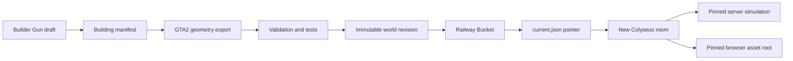

# World Content Architecture And Operations

This document is the source of truth for NOCK0's revisioned world-content pipeline. It covers the
Builder Gun handoff, immutable Railway Bucket packages, server and browser loading, production
promotion, verification, and rollback.

## Current Production Baseline

As of 2026-08-03, production is running the bucket-backed path.

| Item | Value |
| --- | --- |
| Railway project | `HOODLYFE` (`83b28894-83ba-48f4-bb9f-afb558e73313`) |
| Railway service | `hoodlyfe game` (`09995c95-8199-4492-8e35-badd24fd895c`) |
| Environment | `production` |
| Public URL | `https://hoodlyfe.up.railway.app` |
| First bucket-capable commit | `d27b81126505a35b93d9aa1f1f329f6facc7cd15` |
| First published BIL revision | `b2baf9bb160a7542ea3969b0` |
| First bucket-mode deployment | `00812c01-87c1-40a5-8827-34ba372b80a2` |
| Runtime setting | `WORLD_CONTENT_SOURCE=bucket` |

The deployed revision is an operational record, not a permanent configuration value. Future
publishes advance `worlds/bil/current.json` to a new content-derived revision.

## Why This Exists

Previously, map geometry and building definitions were tied to files present when the application
was built. Adding a building therefore required generating files, committing them, rebuilding the
application, and deploying it.

Bucket mode separates engine deployment from content publication:

- the application build supplies server and browser code;
- a world revision supplies map collision, surfaces, lanes, streamed geometry, textures, metadata,
  and seamless-building definitions;
- a room resolves one revision when it is created and never changes revision while players are in
  it;
- the browser receives that pinned revision from Colyseus and loads the matching assets.

This is not a circular dependency. Engine code understands a versioned content schema, while each
content package is immutable data conforming to that schema. A new building using the existing
schema can be published without rebuilding the app. A schema or engine behavior change still
requires a normal code deployment before content using that change is promoted.

## End-To-End Flow



The mutable pointer is only consulted when a room starts. Existing rooms keep their old snapshot;
new rooms receive the newly promoted revision after the server's short pointer cache expires.

## Ownership Boundaries

### Content package

The BIL package includes every file under `public/assets/maps/` plus
`shared/content/buildings/buildings.json`. That currently covers:

- authoritative map collision;
- map metadata and spawn coordinates;
- elevation and surface data;
- traffic lane data;
- streamed Three.js world geometry and chunk files;
- geometry textures and map images under the maps tree;
- seamless building shells, entrances, fixtures, services, and garage-door definitions.

### Application bundle

These remain code or ordinary deployed assets and are not world content:

- simulation algorithms, AI, physics, netcode, and rendering code;
- character, weapon, vehicle, UI, audio, and minimap icon media outside the maps tree;
- player accounts, money, inventory, live entities, room state, and persistence;
- credentials and other secrets;
- arena and secondary-world packages that have not yet adopted this repository.

Do not place mutable player or server state in a world revision.

## Bucket Layout

```text
worlds/bil/current.json
worlds/bil/revisions/<revision>/manifest.json
worlds/bil/revisions/<revision>/content/buildings.json
worlds/bil/revisions/<revision>/maps/district-map.json
worlds/bil/revisions/<revision>/maps/district-map.metadata.json
worlds/bil/revisions/<revision>/maps/surface-manifest.json
worlds/bil/revisions/<revision>/maps/district-lanes.json
worlds/bil/revisions/<revision>/maps/geometry/world.json
worlds/bil/revisions/<revision>/maps/geometry/chunks/*.json
worlds/bil/revisions/<revision>/maps/geometry/tiles.png
```

`manifest.json` records schema version `1`, engine schema version `1`, the six required package
entry points, and SHA-256 checksums for every uploaded file. The 24-character revision ID is derived
from sorted package paths and file checksums, so identical content produces the same revision.

Revision objects are immutable. The publisher uploads assets with immutable cache headers, writes
the manifest last, and writes `current.json` last with `no-store`. If the process stops before the
pointer write, production remains on the previous revision. Rerunning the publisher is safe: an
existing manifest causes immutable uploads to be skipped and the pointer to be advanced.

## Runtime Contract

### Server startup

`server/index.ts` constructs the repository selected by `WORLD_CONTENT_SOURCE` and resolves BIL
before opening the HTTP listener. Missing credentials, a missing pointer, malformed manifests,
missing required files, checksum mismatches, invalid building definitions, and invalid JSON fail
startup. Railway therefore never marks a process healthy with missing authoritative content.

`CollisionMap`, `SurfaceMap`, and `LaneGraph` construction occurs when a room starts. Semantic map,
surface, or lane errors therefore reject room creation and enter the server's fatal room-creation
path rather than being silently ignored.

In bucket mode, the server verifies checksums for the authority-owned map, metadata, surface, lane,
and building documents before constructing a `WorldContentSnapshot`.

### Room pinning

`DistrictRoom` resolves the current snapshot during room creation and uses it to construct a fresh
`CollisionMap`, `LaneGraph`, building catalog, and physics world. Storage is never read during a
simulation tick.

The room replicates these fields:

```text
contentWorldId
contentRevision
contentSource
contentAssetRoot
contentBuildingsPath
```

The process-level current-pointer cache lasts at most 15 seconds. Snapshots are cached by
`worldId:revision`, but a running room owns the snapshot it started with. Publishing does not
hot-swap content beneath connected players.

### Browser delivery

Before `DistrictClient` starts, it reads the replicated descriptor. In bucket mode the root is:

```text
/api/world-content/assets/<world>/<revision>
```

The Next.js route validates the world/revision/path shape, creates a short-lived private Railway
Bucket signed URL on the server, and streams the upstream body through the revision-scoped
same-origin route. The browser never sees bucket credentials or signed URLs. Responses use a
one-year immutable cache policy because revision paths cannot be changed. Geometry chunks, map
metadata, surfaces, and buildings therefore come from the same immutable revision the server is
simulating without depending on cross-origin texture behavior.

The bucket and AWS credentials remain server-side. Never expose them through `NEXT_PUBLIC_*`
variables or browser code.

## Configuration

Local development defaults to bundled files:

```text
WORLD_CONTENT_SOURCE=bundled
```

Bucket mode requires an attached Railway Bucket or equivalent S3-compatible storage:

```text
WORLD_CONTENT_SOURCE=bucket
AWS_ENDPOINT_URL=...
AWS_ACCESS_KEY_ID=...
AWS_SECRET_ACCESS_KEY=...
AWS_S3_BUCKET_NAME=...
AWS_DEFAULT_REGION=auto
AWS_S3_URL_STYLE=virtual
```

The storage adapter also accepts Railway's shorter aliases (`BUCKET_ENDPOINT`,
`BUCKET_ACCESS_KEY_ID`, `BUCKET_SECRET_ACCESS_KEY`, `BUCKET_NAME`, and `BUCKET_REGION`), but the AWS
names above are the documented production contract.

Link the CLI before operating on production:

```bash
railway link --project 83b28894-83ba-48f4-bb9f-afb558e73313 \
  --environment production \
  --service "hoodlyfe game"
railway status
```

Do not print or commit `railway variable list --json`; it contains credential values.

The browser does not need bucket CORS or write access. Builder Gun drafts are local, and trusted
publisher processes write with server-side bucket credentials. Future automated publishing must
continue through an authenticated server-side worker rather than browser bucket writes.

## Builder Gun To Published Building

Open the local authoring client:

```text
http://127.0.0.1:5173/?qa=1&build=1
```

The complete Builder Gun controls and geometry rules are in
[`INTERIOR_AUTHORING_GUIDE.md`](INTERIOR_AUTHORING_GUIDE.md). The production handoff is:

1. Equip the Builder Gun with `G`.
2. Select an elevated connected roof, choose **Store** or **Garage**, and click the intended facade.
3. Inspect the generated footprint, entrance, fixture layout, and vehicle clearance.
4. Use **Copy Draft**. The browser stores drafts locally and releases the selected building so
   another building can be selected.
5. Save the JSON locally and normalize it into the source manifest:

```bash
npm run buildings:publish -- ~/Downloads/building-draft.json \
  --id eastside-quick-mart \
  --label "Eastside Quick Mart"
```

`buildings:publish` validates and adds the definition, calculates exact roof triangle ownership,
runs the geometry-only OpenGTA2 export, validates the map, and runs focused tests. It requires a
local GTA2 installation. If the GTA files are temporarily unavailable, `buildings:import` can
update the manifest, but the result is not publishable until geometry export and validation finish.

The Builder Gun intentionally cannot mutate the production bucket. It creates an untrusted local
draft with `status: "needs-export"`; trusted tooling performs export, review, tests, and promotion.

## Build And Validate A Revision

Run the normal content checks after authoring:

```bash
npm run map:validate
npx tsx --test \
  test/building-manifest.test.ts \
  test/map-interior-contract.test.ts \
  test/world-content.test.ts
npm test
npm run build
git diff --check
```

Inspect the package without touching storage:

```bash
npm run world:publish -- bil --dry-run
```

The dry run prints the deterministic revision, file count, and byte count. Review these before
uploading. The first production package contained 1,036 files and approximately 98.5 MB; large
unexpected changes should be investigated.

## Publish And Promote

The safe rollout order is code first, content second, bucket mode last.

### 1. Deploy compatible engine code

Keep production on bundled mode while deploying an engine/schema change. Commit and push normally,
then wait for Railway:

```bash
git push origin HEAD:main
railway deployment list --limit 1
curl -fsSL https://hoodlyfe.up.railway.app/health
```

The health response must report `status: "ok"` and the expected `buildId`.

### 2. Publish the immutable package

Run the publisher inside Railway's production variable context:

```bash
railway run npm run world:publish -- bil
```

This command uploads the complete revision, writes its manifest, then advances `current.json`.
Publishing the pointer does not restart the game server and does not alter existing rooms.

### 3. Verify signed delivery before switching

Use the revision printed by the publisher:

```bash
curl -fsSL \
  https://hoodlyfe.up.railway.app/api/world-content/assets/bil/<revision>/maps/district-map.metadata.json
curl -fsSL \
  https://hoodlyfe.up.railway.app/api/world-content/assets/bil/<revision>/content/buildings.json
```

Both requests should return cacheable JSON streamed from the private bucket.

### 4. Enable bucket mode

```bash
railway variable set WORLD_CONTENT_SOURCE=bucket --json
railway deployment list --limit 1
```

Changing the variable starts a replacement deployment. Wait for `SUCCESS`; do not treat
`BUILDING` or `DEPLOYING` as completion.

For ordinary later content-only publishes, bucket mode can remain enabled. New rooms resolve the
new pointer after the 15-second cache window; existing rooms remain pinned.

## Production Verification

### Health

```bash
curl -fsSL https://hoodlyfe.up.railway.app/health
```

Verify:

- HTTP 200 and `status: "ok"`;
- the intended `buildId` and a recent `startedAt` after a deployment;
- `simulation.fatal` and `simulation.shuttingDown` are false;
- memory and event-loop delay are within normal operating ranges.

### Live room descriptor

Join a real room rather than inferring success from the HTTP route:

```bash
npx tsx -e "import {Client} from 'colyseus.js'; void (async () => {
  const client = new Client('wss://hoodlyfe.up.railway.app');
  const room = await client.joinOrCreate('district', {name: 'Content QA'});
  if (!room.state?.players) {
    await new Promise((resolve) => room.onStateChange.once(resolve));
  }
  console.log(JSON.stringify({
    roomId: room.roomId,
    worldId: room.state.contentWorldId,
    revision: room.state.contentRevision,
    source: room.state.contentSource,
    assetRoot: room.state.contentAssetRoot,
    buildingsPath: room.state.contentBuildingsPath
  }, null, 2));
  await room.leave(true);
})();"
```

For bucket production, require:

```text
source: bucket
revision: <the published revision>
assetRoot: /api/world-content/assets/bil/<the published revision>
buildingsPath: content/buildings.json
```

### Logs and repository state

```bash
railway logs --deployment <deployment-id> --lines 150
git status --short --branch
git log -1 --oneline --decorate
```

The process should log that the district server is listening and contain no world-content startup
errors. The local commit intended for production should match `origin/main`.

### First rollout result

The 2026-08-03 rollout established this reproducible baseline:

- deployment `00812c01-87c1-40a5-8827-34ba372b80a2` reached `SUCCESS`;
- `/health` returned HTTP 200, `status: "ok"`, and build ID `d27b811...`;
- the published package contained 1,036 files totaling 98,503,591 bytes;
- the signed metadata and building routes returned HTTP 200 after redirect;
- a real production `district` room reported `source: "bucket"`, revision
  `b2baf9bb160a7542ea3969b0`, and `content/buildings.json`;
- the building package parsed with eight definitions;
- no fatal or world-content errors appeared in deployment logs.

Two non-fatal warnings remained: Node `20.20.2` will stop receiving new AWS SDK v3 releases after
the first week of January 2027, and one dependency emits a deprecated initialization-parameter
warning. Upgrade the production runtime to Node 22 before that AWS SDK cutoff and remove the
deprecated initialization call as separate maintenance work.

## Rollback And Recovery

### Fast operational rollback

If bucket loading or gameplay fails, switch back to the content bundled with the deployed engine:

```bash
railway variable set WORLD_CONTENT_SOURCE=bundled --json
railway deployment list --limit 1
curl -fsSL https://hoodlyfe.up.railway.app/health
```

Wait for the replacement deployment to reach `SUCCESS`. New rooms should then report
`source: bundled` and a revision beginning with `bundled-`.

### Bad content revision

Do not delete or overwrite the bad revision. Immutable objects are evidence and make incidents
reproducible. The current CLI publishes the local package and advances the pointer; it does not yet
provide a dedicated `promote-existing-revision` command. Until that command exists, use bundled mode
as the immediate rollback, restore known-good local source assets, republish them, verify the signed
files, and then re-enable bucket mode.

### Failed publish

- Failure before `manifest.json`: the pointer is unchanged; rerun the publisher.
- Failure after the manifest but before `current.json`: the revision is complete but inactive;
  rerun the publisher to advance the pointer.
- Failure after `current.json`: new rooms may resolve the new revision. If validation missed a
  gameplay defect, use the operational rollback immediately.
- Startup failure in bucket mode: Railway health never succeeds. Inspect build/deployment logs, then
  restore bundled mode rather than deleting bucket objects.

## Failure Signatures

| Symptom | Likely cause | Action |
| --- | --- | --- |
| `WORLD_CONTENT_SOURCE=bucket requires bucket credentials` | Bucket variables are absent from the game service | Attach/reference the bucket variables or return to bundled mode |
| `has no current revision` | `worlds/bil/current.json` was never published | Run the publisher with Railway variables |
| `revision is missing .../manifest.json` | Pointer was manually changed or package is incomplete | Restore bundled mode and republish |
| `checksum mismatch` | An immutable object was overwritten or upload is corrupt | Do not promote it; republish known-good source as a new revision |
| Signed asset route returns 404 | World/revision does not have a manifest | Check the room descriptor and requested revision |
| Browser reports `Failed to fetch` after joining | Same-origin asset proxy or Railway connectivity failed | Inspect the failed asset path and Railway logs |
| Signed asset route returns 500 | Credentials, endpoint, signing, upstream fetch, or bucket access failed | Inspect Railway logs and bucket variable references |
| Server uses new collision but browser shows old geometry | Client did not use the room's `contentAssetRoot`, or a non-revision URL was cached | Inspect the live room descriptor and network requests |
| New publish is not visible in an existing room | Expected room pinning behavior | Create a new room after the pointer cache expires |

## Security And Integrity Rules

- Keep the bucket private; browsers receive short-lived signed object URLs.
- Never commit `.env` files, Railway variable output, access keys, or signed URLs.
- Treat Builder Gun JSON as untrusted input until the parser, exporter, validator, and tests pass.
- Never mutate files under an existing revision prefix.
- Never write `current.json` before every required object and the manifest are complete.
- Keep server-owned collision, lanes, surfaces, and buildings in the same revision as browser
  geometry.
- Do not use the bucket as a database for accounts, economy, inventories, or live room state.

## Current Limitations And Next Automation Step

- Publishing is a trusted CLI operation; the browser cannot enqueue a production publish.
- The package is a complete upload. Delta/base-revision reuse is a future optimization.
- Only active BIL content uses this repository. Arena and secondary district packages still use
  bundled paths.
- Railway Buckets do not provide the publication lock and audit workflow needed for concurrent
  authors.
- There is no first-class command to promote an already uploaded revision or list revision history.
- Browser assets are served through signed redirects, but client-side checksum verification is not
  yet implemented.

The next automation step is an authenticated publish worker, not direct browser-to-bucket writes.
It should accept a stored draft, acquire a database-backed publication lock, run the exact existing
import/export/test/package pipeline, upload the immutable revision, record an audit row, and require
an explicit promotion action before writing `current.json`. The CLI remains the reference behavior
for that worker.
