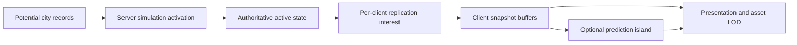

# World Interaction Netcode And Streaming Architecture

Status: Research baseline for implementation planning  
Date: 2026-07-12  
Scope: Players, pedestrians, vehicles, combat, world objects, population, interiors, and persistent interactions

## 1. Purpose

NOCK0 is not a racing game with only cars and it is not an arena shooter with only
players. It is intended to become a persistent, top-down multiplayer city where:

- players walk, drive, fight, ride together, enter buildings, and use services;
- pedestrians perceive incidents, flee, investigate, fight, report crimes, and die;
- traffic, police, projectiles, fires, doors, pickups, and mission objects interact;
- the browser responds immediately despite internet latency;
- the server remains authoritative over physical outcomes, health, ownership, money,
  inventory, missions, and persistent state;
- the cost of an entire city is bounded even when no player is near most of it.

This document generalizes the vehicle prediction research in
[`MULTIPLAYER_NETCODE_ENGINE_EVALUATION.md`](MULTIPLAYER_NETCODE_ENGINE_EVALUATION.md)
into a world-wide model. It records the architecture and technical contracts that
the next implementation plan must satisfy. It does not authorize a Lance migration,
global rollback, client-authoritative physics, or simulation of every city entity on
every browser.

## 2. Executive Decision

NOCK0 should retain a Colyseus-authoritative district simulation and use different
network models for different entity and interaction families.

The governing rule is:

> Predict the locally controlled action and the smallest bounded set of entities
> required to make that action responsive. Interpolate ordinary remote actors.
> Rewind historical hitboxes only for server-side queries that require the player's
> past view. Never predict durable outcomes.

There is no single correct replication mode for the whole world. Unreal's networked
physics documentation explicitly supports mixing resimulation actors with cheaper
predictive-interpolation actors, because resimulation consumes history, CPU, and
memory while providing more accurate physical interactions
([Epic, Networked Physics Overview](https://dev.epicgames.com/documentation/en-us/unreal-engine/networked-physics-overview)).
Netick reaches the same conclusion from the opposite direction: ordinary remote
interpolation is appropriate for shooter-like movement, while predicting remote
objects becomes useful when immediate physical interaction is more important than
occasional misprediction
([Netick, Prediction In-Depth](https://netick.net/docs/2/articles/prediction-in-depth.html)).

The target architecture therefore has four independent selection systems:

1. **Simulation activation** decides which potential world entities exist as
   full authoritative actors on the district server.
2. **Replication interest** decides which authoritative state each client is
   allowed and required to receive.
3. **Prediction participation** decides which received entities a client must
   restore and replay on its current interaction timeline.
4. **Presentation LOD** decides which models, animations, labels, lights, sounds,
   and effects the browser renders.

These sets overlap, but they are not interchangeable. A client observing a car does
not own its simulation. A server materializing a pedestrian does not imply every
client receives it. Receiving a remote player does not imply predicting that player.
Hiding a model does not remove the authoritative actor.

## 3. Evidence From The Reviewed Systems

### 3.1 Valve Source: three timelines for character games

Valve's documented model separates:

- local input prediction for immediate owned-player movement;
- delayed snapshot interpolation for remote actors;
- server-side historical rewind for hit validation.

Source samples user commands, sends them with acknowledgement information, predicts
the local player, and renders remote entities in the recent past between buffered
snapshots. For a shot, the server estimates command execution time from latency and
client interpolation, temporarily restores historical target hitboxes, validates
the shot, and returns the world to the present
([Valve, Source Multiplayer Networking](https://developer.valvesoftware.com/wiki/Source_Multiplayer_Networking)).

The critical limitation is also explicit: a client normally cannot accurately
predict another player's future input. This is why arbitrary remote characters
should remain interpolated rather than all being promoted into rollback simulation.

### 3.2 Unreal: resimulation is selective and expensive

Unreal's resimulation mode caches physics state each tick for at least a latency
window, compares an incoming authoritative state with the matching historical state,
rewinds when the error exceeds policy, replays inputs, and smooths only the resulting
render correction. Unreal also documents that interaction quality degrades with
latency and speed, and that predictive interpolation is cheaper than full
resimulation
([Epic, Networked Physics Overview](https://dev.epicgames.com/documentation/en-us/unreal-engine/networked-physics-overview)).

NOCK0 should use the same selective principle with a much smaller deterministic 2D
kernel instead of trying to reproduce a broad 3D rigid-body scene.

### 3.3 Netick Rocket Cars: interacting bodies need one timeline

Netick's Rocket Cars sample predicts all cars and the ball because a local-only
predicted car colliding with delayed remote cars produces an RTT-delayed result. The
sample replicates each remote driver's last applied input and reuses it during proxy
prediction rather than inventing future input
([Netick, Prediction In-Depth](https://netick.net/docs/2/articles/prediction-in-depth.html),
[Rocket Cars source](https://github.com/NetickNetworking/NetickRocketCars)).

That lesson applies beyond vehicles, but only where a true interaction requires it:

- two colliding cars need one short physical timeline;
- a car about to strike a pedestrian needs a time-aligned pedestrian proxy;
- a pushed crate and the player pushing it need one contact timeline;
- two ordinary players merely visible across a road do not.

### 3.4 Lance: replay state, then bend presentation

Lance's extrapolation strategy stores recent inputs, accepts an older authoritative
state, re-enacts inputs, and applies separate visual bending policies for local and
remote objects
([Lance `ExtrapolateStrategy.ts`](https://github.com/lance-gg/lance/blob/fd9bc5dce93f59684acc0c862a3a7849b993f65a/src/syncStrategies/ExtrapolateStrategy.ts#L44-L207)).
Lance also demonstrates client-created shadow objects correlated with later server
objects
([Lance `GameEngine.ts`](https://github.com/lance-gg/lance/blob/fd9bc5dce93f59684acc0c862a3a7849b993f65a/src/GameEngine.ts#L148-L167)).

NOCK0 should independently implement those small patterns inside Colyseus. The
simulation state must correct immediately. Only the render transform and cosmetic
effects may bend toward the corrected state.

### 3.5 SuperTuxKart: state history and event history are different

SuperTuxKart restores confirmed world state, replays tick-stamped events and physics,
and computes a separate graphical correction after replay. Its implementation
explicitly prevents replayed events from being recorded as new events
([STK `rewind_manager.cpp`](https://github.com/supertuxkart/stk-code/blob/4c7638f0a06beafe0586a404eb0267be62e17bc8/src/network/rewind_manager.cpp#L294-L407),
[STK `rewind_queue.cpp`](https://github.com/supertuxkart/stk-code/blob/4c7638f0a06beafe0586a404eb0267be62e17bc8/src/network/rewind_queue.cpp#L201-L289)).

This distinction is mandatory for NOCK0. Replaying movement cannot replay gun audio,
camera shake, crime registration, damage, payouts, particles, or notices as if they
were newly created.

### 3.6 Ring Racers: compact commands and deterministic diagnostics

Ring Racers uses compact per-tick commands, an explicit missing-command policy,
fixed-point simulation, validation, and consistency checks
([`d_ticcmd.h`](https://github.com/KartKrewDev/RingRacers/blob/d8b4e8a39ac1f032e8a9fd6c487659128f280b77/src/d_ticcmd.h#L52-L89),
[`d_clisrv.c`](https://github.com/KartKrewDev/RingRacers/blob/d8b4e8a39ac1f032e8a9fd6c487659128f280b77/src/d_clisrv.c#L6614-L6813)).

NOCK0 should adopt command packing, validation, stable ordering, deterministic random
streams, and state hashes. It should not use whole-world lockstep because one missing
player command must not stall a persistent city, and deterministic lockstep would
force every pedestrian, projectile, AI decision, and lifecycle event into one global
timeline.

### 3.7 GTA III/Vice City reverse-engineered source: population is managed

The studied Vice City source separates pedestrian population, traffic population,
zones, pathfinding, and short-lived perceived events. Population work is incremental
and considers world limits, zones, distance, visibility, and actor classification;
traffic creation follows path and lane data rather than arbitrary empty ground
([`Population.cpp`](https://github.com/daynz/GTAviceCity/blob/3233ffe1c4b99e8efb4c41c6794b4fce880cf503/src/peds/Population.cpp),
[`CarCtrl.cpp`](https://github.com/daynz/GTAviceCity/blob/3233ffe1c4b99e8efb4c41c6794b4fce880cf503/src/control/CarCtrl.cpp),
[`PathFind.cpp`](https://github.com/daynz/GTAviceCity/blob/3233ffe1c4b99e8efb4c41c6794b4fce880cf503/src/control/PathFind.cpp)).

Its event list is bounded and expiring; repeated events refresh existing semantic
entries instead of growing forever
([`EventList.cpp`](https://github.com/daynz/GTAviceCity/blob/3233ffe1c4b99e8efb4c41c6794b4fce880cf503/src/core/EventList.cpp)).

The transferable lesson is not single-player client authority. It is the ownership
model: the city is represented by budgets, potential records, paths, zones, and
events, while only a bounded nearby subset exists at full fidelity.

### 3.8 Colyseus: per-client visibility is a projection, not a world database

Colyseus 0.16 `StateView` allows individual schema instances to be added to or removed
from each client's view. Its documentation specifically lists area-based data and
level of detail as appropriate uses, while warning that `StateView` is not optimized
for very large datasets
([Colyseus, StateView](https://0-16-x.docs.colyseus.io/state/view)).

NOCK0 should keep authoritative district collections bounded and use StateView as the
final per-client projection. It must not create millions of schema entities and rely
on StateView to hide them.

## 4. The Four Timelines

Every networked actor shown by a client belongs to one of four timing models.

### 4.1 Authoritative server timeline

The district server advances one canonical fixed tick. It owns:

- valid transforms and collision outcomes;
- health, armor, death, arrests, and respawns;
- vehicle seats, hijacks, damage, ignition, and destruction;
- ammunition, cooldowns, projectile creation, impacts, and explosions;
- pedestrian AI decisions, perception, memory, and faction behavior;
- wanted state, witnesses, police dispatch, mission phases, and rewards;
- pickups, inventories, property access, purchases, and currency;
- materialization and dematerialization of ambient population.

NOCK0 already has a bounded 60 Hz `FixedStepClock`
([`fixed-step-clock.ts`](../server/game/world/fixed-step-clock.ts)) and stable spatial
queries ([`spatial-index.ts`](../server/game/world/spatial-index.ts)). Those remain the
canonical time and broad-phase foundations.

### 4.2 Local predicted timeline

The owning browser applies a validated local input command immediately and runs the
same pure movement/contact functions expected on the server. This timeline is ahead
of the latest received authority. It contains only:

- the local controlled player or vehicle;
- locally initiated provisional objects when their family supports prediction;
- bounded nearby entities required for immediate collision or constraint response.

The client saves input and predicted state by tick or sequence. When authority for an
older tick arrives, it compares historical states, restores all members of the
relevant prediction island to the same tick, and replays unacknowledged inputs.

### 4.3 Remote render timeline

Most remote players, NPCs, cars, and moving props render in the recent past from a
timestamped snapshot buffer. Interpolation absorbs variable packet arrival and avoids
inventing abrupt future player choices. Short extrapolation may bridge a small gap;
after a strict horizon the actor freezes or degrades instead of drifting indefinitely.

Snapshot interpolation deliberately adds visual delay. Valve documents the same
tradeoff, and Glenn Fiedler's original treatment explains the interpolation buffer
and packet-loss behavior
([Gaffer On Games, Snapshot Interpolation](https://gafferongames.com/post/snapshot_interpolation/)).

### 4.4 Historical query timeline

The server keeps a bounded history of combat-relevant hitboxes and world revisions.
When it receives a timestamped action such as hitscan fire, it can query the historical
state the attacker observed. This is not general world rollback. The server restores
or queries historical collision representations, resolves the action once, and keeps
the present simulation authoritative.

The historical timeline is appropriate for hitscan and possibly short melee windows.
It is not appropriate for retroactively rerunning vehicle pileups, explosions,
pedestrian AI, economy, or mission logic.

## 5. Entity Network Policy Matrix

| Entity or interaction | Simulation authority | Normal client model | Promotion condition | Durable outcome |
|---|---|---|---|---|
| Owned on-foot player | Server | Local prediction and replay | Always while controllable | Server |
| Owned driven vehicle | Server | Local prediction and replay | Always while driving | Server |
| Remote player | Server | Snapshot interpolation | Imminent hard physical contact only | Server |
| Passenger | Server | Vehicle-relative interpolation; local aim prediction | Owned passenger aim/fire | Server |
| Ambient pedestrian | Server when active; virtual record when dormant | Snapshot interpolation | Imminent car/push/contact proxy | Server |
| Police or mission NPC | Server | Snapshot interpolation | Contact proxy; never client AI | Server |
| Traffic vehicle | Server when active; virtual route when dormant | Snapshot interpolation | Swept collision horizon with owned actor | Server |
| Hitscan shot | Server historical query | Immediate local fire presentation | Never a physical prediction body | Server hit/damage |
| Slow projectile | Server | Authoritative replication | Never | Server impact/damage |
| Grenade or rocket | Server | Authoritative replication | Never | Server fuse/impact/damage |
| Door or gate | Server | Optimistic animation | Local use awaiting confirmation | Server open/lock state |
| Movable prop | Server | Interpolation or bounded contact prediction | Being pushed/hit by owned actor | Server final pose/damage |
| Pickup | Server | Optimistic hide/pending state | Local collection request | Server inventory/economy |
| Shop/service | Durable service | Immediate pending UI | Valid local transaction request | Durable ledger |
| Fire/explosion | Server | Immediate cosmetic anticipation if locally caused | Never replay damage locally | Server damage/lifetime |
| Property/interior | Durable service plus room authority | Streamed space transition | Player admission/doorway | Durable ownership |

Promotion into prediction never transfers ownership. It only places a temporary
physical proxy on the client's replay timeline.

## 6. Command Contract

Every player-controlled action should originate from one compact, monotonically
sequenced input command rather than unrelated movement, aim, fire, and interaction
messages with ambiguous ordering.

```ts
interface PlayerInputCommand {
  sequence: number;
  clientTick: number;
  clientSampleTimeMs: number;
  moveX: number;              // normalized [-1, 1]
  moveY: number;              // normalized [-1, 1]
  aimAngle: number;           // normalized radians
  buttons: number;            // bitset: fire, melee, use, enter, sprint, etc.
  selectedWeaponSlot: number;
  controlledEntityId: string; // player or occupied vehicle
}
```

The server should attach:

```ts
interface AppliedInputReceipt {
  playerId: string;
  controlledEntityId: string;
  serverTick: number;
  appliedSequence: number;
  rejectedButtons: number;
  lateByTicks: number;
}
```

Required validation:

- sequence is monotonic and inside a bounded acceptance window;
- axes and angles are finite, clamped, and normalized;
- command rate and queue depth are bounded;
- the player owns or occupies `controlledEntityId` in the claimed role;
- input is legal for alive/action/seat/interior state;
- edge actions cannot be repeated by resending a held command;
- stale held movement expires to neutral;
- stale fire/use/melee edges are discarded rather than executed late;
- client timestamps are mapped through a measured clock offset and clamped to a
  bounded server history window.

The browser may repeat recent commands in outbound packets for loss tolerance, but
the server applies each sequence at most once. This follows the acknowledged command
pattern documented by Valve and the compact-command discipline visible in Ring
Racers, without adopting global lockstep.

## 7. Canonical Simulation State

Prediction requires explicit simulation state. A sprite position is not enough.

### 7.1 Common kinematic state

```ts
interface KinematicState {
  id: string;
  kind: 'player' | 'pedestrian' | 'vehicle' | 'prop' | 'projectile';
  spaceId: string;
  layerId: string;
  x: number;
  y: number;
  angle: number;
  velocityX: number;
  velocityY: number;
  angularVelocity: number;
  colliderRevision: number;
  lifecycleRevision: number;
}
```

### 7.2 On-foot state

```ts
interface OnFootSimulationState extends KinematicState {
  radius: number;
  movementMode: 'idle' | 'walk' | 'run' | 'sprint' | 'aim';
  actionPhase: 'free' | 'melee' | 'reload' | 'hit' | 'knockdown' | 'entering';
  actionTick: number;
  surfaceId: string;
  alive: boolean;
}
```

The predicted state should contain locomotion and collision fields, not cosmetic
animation frame numbers. Animation derives from simulation state and render time.

### 7.3 Vehicle state

Vehicle state must include transform, speed or linear velocity, steering state,
angular velocity if modeled, damage-relevant body revision, and last applied input.
The detailed contract remains in
[`MULTIPLAYER_NETCODE_ENGINE_EVALUATION.md`](MULTIPLAYER_NETCODE_ENGINE_EVALUATION.md).

### 7.4 Interaction snapshot

```ts
interface InteractionSnapshot {
  serverTick: number;
  serverTimeMs: number;
  worldCollisionRevision: number;
  acknowledgedLocalInputSequence: number;
  entities: KinematicState[];
  remoteIntents: RemoteIntentState[];
  confirmedEventsThrough: number;
}

interface RemoteIntentState {
  entityId: string;
  appliedAtServerTick: number;
  moveX: number;
  moveY: number;
  steering: number;
  throttle: number;
}
```

The snapshot does not expose private AI plans, hidden mission data, inventories, or
future route choices. It exposes only enough physical state and recent applied intent
to predict a short contact horizon.

## 8. The Generalized Interaction Island

An interaction island is a per-client, short-lived, bounded replay set. It is not a
server partition and it is not the client's area of interest.

### 8.1 Membership sources

The owned controlled actor is always the root. Candidate members come from:

- current contacts;
- swept broad-phase overlap during a bounded future horizon;
- shared constraints such as seat/vehicle or player/pushed-prop attachment;
- local predicted projectiles whose physical family requires replay;
- authoritative correction snapshots that identify a recent contact pair.

Selection should use time-to-contact, not distance alone:

```text
horizonSeconds = clamp(
  halfRtt + interpolationDelay + jitterMargin,
  minimumHorizon,
  maximumHorizon
)

sweptReach = actorSpeed * horizonSeconds
           + candidateSpeed * horizonSeconds
           + colliderMargin
```

Candidates are queried from the existing spatial index, tested with exact swept
shapes, scored, sorted by stable ID after priority, and capped.

### 8.2 Membership rules

- An entity cannot enter without a complete authoritative baseline for one tick.
- Current contacts outrank possible future contacts.
- Player-controlled and mission-critical bodies outrank ambient bodies.
- Membership uses enter/exit hysteresis and a brief contact-retention window.
- A hard cap bounds CPU, memory, snapshot size, and worst-case replay.
- If the cap is exceeded, lower-priority contacts stay server-authoritative and the
  client uses conservative collision presentation rather than silently adding cost.
- All members restore to exactly the same authoritative tick before replay.
- Dynamic pairs resolve in stable ordered pairs so collection order cannot change
  the result.

The existing vehicle research recommends local plus seven collision-relevant cars as
the first vehicle cap. A world-wide cap must be measured separately because pedestrian
kinematics are cheaper than vehicle contacts and projectiles have different lifetimes.

### 8.3 Replay sequence

1. Receive one immutable authoritative snapshot.
2. Match it to saved local input and saved island state by `serverTick`.
3. Reject replay if the world collision or lifecycle revision is incompatible.
4. Restore every island member to the same baseline tick.
5. Remove acknowledged local commands.
6. Replay fixed ticks to the current predicted tick.
7. Apply exact saved local commands to the owned actor.
8. Apply bounded remote-intent continuation to promoted remote proxies.
9. Step shared static collision and dynamic contacts in stable order.
10. Suppress gameplay and one-shot presentation side effects during replay.
11. Replace canonical client physics state immediately.
12. Calculate old-render-to-new-simulation offsets and decay only those offsets.

### 8.4 Remote intent continuation

For a promoted remote entity, the client cannot know a new input before it arrives.
It may briefly hold the last server-applied input, then decay it toward neutral. This
is the behavior documented by Netick and exercised by Rocket Cars. The hold and decay
window must be short, type-specific, and visible in diagnostics.

Remote pedestrian AI is never executed on the browser. A promoted pedestrian proxy
continues a last known velocity or locomotion intent only long enough to make a likely
contact immediate. Its actual dodge, flee, attack, or route decision remains server
state and may correct the proxy.

## 9. On-Foot Player Movement

### 9.1 Local movement

The browser should run a shared pure `stepOnFoot` function at the authoritative fixed
rate. The function consumes prior simulation state, current command, static collision,
and a bounded dynamic-contact set. It returns the next state and typed contact facts.

The function must own:

- normalized acceleration and deceleration;
- walk/run/sprint speed policy;
- aim-facing versus movement-facing policy;
- action-state movement modifiers;
- collision-safe swept movement;
- surface modifiers;
- deterministic crowd separation/contact response;
- stable final quantization.

The current [`LocalMovementReplay`](../src/game/prediction/local-movement-replay.ts)
replays recent vectors over a server position, but it does not yet save complete
fixed-tick locomotion state or run shared dynamic collision. It is a presentation
bridge, not the final prediction system.

### 9.2 Remote players

Ordinary remote players should remain interpolated. Hard player-to-player blocking
should be used sparingly because local prediction and delayed remote timelines make
it correction-prone. Recommended interaction families are:

- soft crowd separation for ordinary walking;
- explicit server-authoritative shove/knockdown events for meaningful contact;
- interaction-island promotion during grapples, carried objects, or other future
  constrained mechanics;
- server historical queries for weapon hitboxes, not remote player prediction.

This preserves responsive movement while avoiding constant body snaps in crowds.

### 9.3 Presentation transform ownership

Every visual attachment must resolve from one final presentation transform:

```text
authoritative state
  -> prediction/reconciliation
  -> render correction offset
  -> final actor presentation transform
  -> sprite, weapon, label, shadow, light, passenger marker, effects
```

Weapons, labels, lights, and debug shapes must not independently read stale schema
coordinates after the local body has moved to a predicted pose. The reported floating
gun defect is an example of violating this rule, not a simulation failure.

## 10. Pedestrian And Police Simulation

### 10.1 Authority boundary

Pedestrian brains remain server-only. Clients receive outputs such as:

- transform and velocity;
- locomotion/action state;
- aim/facing direction;
- target-visible presentation flags when permitted;
- health, armor, damage reaction, and lifecycle revision;
- stable animation/event triggers.

Clients do not receive or execute hidden perception memory, future paths, police
search locations, witness policy, mission conditions, or random decisions.

### 10.2 Simulation levels

The district should represent ambient population at multiple server simulation levels:

| Level | Representation | Typical work |
|---|---|---|
| Active | Full schema actor plus runtime controller | Fixed-step locomotion, collision, perception schedules, combat |
| Reduced | Lightweight authoritative runtime | Coarse path following, infrequent perception, no expensive local avoidance |
| Virtual | Plain potential record | Zone, route segment, schedule, coarse progress, deterministic seed |
| Durable | Persistent record | Ownership, customization, mission or property state only |

NOCK0 already materializes potential pedestrians and traffic near player anchors,
dematerializes eligible actors beyond a larger radius, advances dormant records in
coarse steps, and pins occupied/damaged/mission entities
([`population-streaming-controller.ts`](../server/game/population/population-streaming-controller.ts)).

The next design should add a reduced level rather than jumping directly from full
60 Hz actors to 3-second virtual movement for every family.

### 10.3 Materialization contract

A virtual actor record should contain enough information to recreate continuity:

```ts
interface VirtualActorRecord {
  id: string;
  archetype: string;
  zoneId: string;
  routeId: string;
  routeProgress: number;
  schedulePhase: string;
  appearanceSeed: number;
  behaviorSeed: number;
  activationEpoch: number;
  durableFlags: number;
  lastCoarseTick: number;
}
```

Materialization must validate spawn visibility, navigation connectivity, collision
footprint, nearby players, reservations, interior layer, and actor caps. The actor
should appear as a plausible continuation of the virtual record, not restart from a
global spawn point.

### 10.4 Pins and safe dematerialization

An actor cannot dematerialize while it is:

- visible at close range;
- in combat or recently damaged;
- a witness with unresolved reporting state;
- pursuing or pursued;
- occupying or controlling a vehicle;
- mission-owned, crew-relevant, arrested, downed, or carrying a persistent object;
- on fire, destroyed, or involved in an unresolved contact;
- referenced by a durable transaction or pending authoritative event.

Dematerialization first captures coarse route and lifecycle state, unregisters
runtime owners, emits a typed lifecycle fact, and removes synchronized schema state
through the deferred lifecycle phase.

### 10.5 World events and perception

Combat systems should not call every pedestrian directly. Authoritative actions emit
bounded typed facts. A perception adapter converts relevant facts into expiring
stimuli, and scheduled pedestrian perception queries nearby stimuli. This follows the
bounded event ownership found in the studied GTA source and is already represented by
NOCK0's `GameEventStream` and pedestrian stimulus registry
([`game-events.ts`](../server/game/events/game-events.ts),
[`PEDESTRIAN_EVENT_PERCEPTION_RESEARCH.md`](PEDESTRIAN_EVENT_PERCEPTION_RESEARCH.md)).

Replay code must never publish a second authoritative stimulus. It may replay a
deterministic movement reaction locally, but only the server creates the crime,
witness, wanted, and damage facts.

## 11. Combat Networking

### 11.1 Immediate presentation versus authoritative result

When the local player fires, the browser may immediately show:

- attack animation;
- weapon recoil;
- muzzle flash;
- shell and smoke cosmetics;
- local audio;
- a provisional projectile model when applicable.

The server alone decides whether the action was legal, consumes ammunition, creates
the canonical projectile or historical query, applies impact and damage, reports a
crime, and awards money.

### 11.2 Hitscan

Hitscan should use bounded server-side lag compensation:

1. Receive an authenticated command with sequence and client sample time.
2. Map client time to server time through the clock-offset estimate.
3. Clamp to a maximum rewind window and never before the actor joined or changed
   space/lifecycle revision.
4. Query historical target hitboxes and relevant historical obstruction revisions.
5. Validate origin, weapon, range, fire rate, ammunition, and shooter state.
6. Resolve the hit exactly once on the present authoritative world.
7. Emit confirmed impact, damage, crime, and kill events.

Valve's implementation history is one second, but NOCK0's fairness window must be
chosen from measured regional latency and game mode. Real-value or ranked modes may
use a tighter cap than private Freemode.

### 11.3 Physical projectiles

Slow bullets, rockets, and thrown weapons are server-created authoritative entities.
The client sends only the sequenced fire command and its sampled server time; it does
not create projectile IDs or wait for per-shot receipts. The server catches bullets
up through a bounded historical query, then replicates any surviving projectile and
emits authoritative impact and damage events.

Local projectile shadows may be added later as presentation-only prediction, but
they require a separately versioned protocol and must never apply damage.

### 11.4 Melee

Melee should keep locomotion prediction active while an attack action is in progress.
The server validates a timestamped swept arc or capsule over authored active frames,
with bounded historical target queries. It owns stamina, cooldown, combo legality,
hit reaction, damage, and knockdown.

Melee should not rewind the whole world. It queries a short history of relevant
hitboxes and obstruction, then applies one present-time result. Movement prediction
replays the action's movement modifier, not the damage side effect.

### 11.5 Explosions, fire, and vehicle impacts

These are broad physical/world events and should resolve at server time. A client can
anticipate presentation for its own grenade or rocket, but it must not rewind and
recompute all victims. The server publishes one authoritative explosion/fire event
with stable identity; clients deduplicate presentation by event ID.

## 12. Doors, Pickups, Seats, And Transactions

### 12.1 Optimistic interaction pattern

World interactions should use a request/confirm/reject state machine:

```ts
interface InteractionRequest {
  requestId: string;
  playerId: string;
  inputSequence: number;
  targetId: string;
  action: 'open' | 'pickup' | 'enter' | 'hijack' | 'buy' | 'use-service';
  clientSampleTimeMs: number;
}
```

The browser may enter `pending` presentation immediately. The server validates range,
space, visibility where required, ownership, locks, capacity, cooldown, funds, and
current revisions. It returns a stable result keyed by `requestId`.

### 12.2 Doors and gates

Door animation may begin optimistically, but collision changes only against a
predicted door state with a known revision. Rejection returns it to the canonical
state. Shared doors with multiple users remain server-owned and broadcast one state
revision.

### 12.3 Pickups

A client may temporarily hide a touched pickup, but the server decides the winner.
On rejection the pickup returns. Inventory and economy never change optimistically.
This is especially important when two players touch one item during the same tick.

### 12.4 Vehicle entry, passengers, and hijacking

Seat changes are atomic server transactions:

1. reserve target vehicle and seat;
2. validate distance, speed, door side, state, and competing request order;
3. enter an action phase while the player remains a world actor;
4. transfer occupancy/control at an authored commit frame;
5. release reservation on interruption, death, movement, destruction, or timeout;
6. replicate one canonical occupant map and lifecycle revision.

The client predicts animation and camera response, not seat ownership. Passenger aim
can be locally predicted, while projectile creation and seat-correct muzzle origin
remain authoritative.

### 12.5 Economy and persistent services

Purchases, mission rewards, property, owned cars, and future onchain settlement need
idempotency keys and a durable ledger. A district emits an authoritative gameplay
event; a service applies policy and persistence outside the 60 Hz tick. The browser
shows `pending`, `confirmed`, or `rejected`, never a locally trusted balance. See
[`ONCHAIN_INTEGRATION.md`](ONCHAIN_INTEGRATION.md).

## 13. World Streaming Architecture

### 13.1 Three distinct streaming systems



1. **Simulation streaming** converts potential records to active server actors and
   back. It is driven by merged player/mission anchors and server budgets.
2. **Network streaming** projects active state per client. It is driven by visibility,
   interaction relevance, privacy, bandwidth, and patch budgets.
3. **Presentation streaming** loads map chunks, models, textures, animation atlases,
   sounds, lights, and effects. It is driven by camera and device budgets.

### 13.2 Spatial hierarchy

The city should use stable authored identifiers:

```text
region
  district room
    space (street, shop, hospital, garage, apartment)
      simulation cell
        navigation/road sectors
        static collision revision
        potential population slots
```

An entity carries `districtId`, `spaceId`, `layerId`, and spatial cell membership.
Interior separation must be explicit; coordinate proximity alone must never replicate
street actors into an interior.

### 13.3 Merged server interest

Simulation activation uses all room anchors, not one population per player. Anchors
include:

- player-controlled actors and occupied vehicles;
- participant mission objectives;
- active police/pursuit fronts;
- recent combat/contact zones;
- persistent or crew-owned property currently in use;
- safe materialization lookahead along high-speed vehicle paths.

Overlapping anchors merge. Ten nearby players should share one street population,
not multiply ambient population tenfold.

### 13.4 Suggested LOD bands

Final numbers require profiling, but the policy shape should be:

| Band | Server simulation | Replication | Browser presentation |
|---|---|---|---|
| Contact | Full fixed tick | High-priority frequent state plus events | Full model, animation, effects; prediction eligible |
| Near | Full fixed tick or scheduled AI | Frequent snapshots | Full model and animation |
| Mid | Reduced movement and perception cadence | Lower-frequency transform/state | Simplified animation/effects |
| Far-active | Coarse route/schedule | Markers or no actor state | Optional minimap/mission marker |
| Virtual | Potential record only | None | None |
| Durable | Database/service record | On-demand service payload | Menus/property summaries only |

Band transitions need independent enter/exit thresholds, operation budgets, and
minimum residency times to prevent churn.

### 13.5 Current NOCK0 alignment

NOCK0 already separates server population activation from network AOI:

- street actors enter a client's replication view at 1,280 pixels and leave at
  1,536 pixels, with per-patch add/remove budgets
  ([`street-streaming-policy.ts`](../server/game/replication/street-streaming-policy.ts));
- potential population materializes at 1,536 pixels and dematerializes at 1,920
  pixels, with active caps and per-tick operation budgets
  ([`population-streaming-controller.ts`](../server/game/population/population-streaming-controller.ts));
- `DistrictReplicationController` uses Colyseus `StateView`, same-space filtering,
  mission/occupancy pins, stable priority, and complete-snapshot handling
  ([`district-replication-controller.ts`](../server/game/replication/district-replication-controller.ts));
- interiors receive same-space players/services rather than street collections
  ([`STATE_VIEW_REPLICATION_RESEARCH.md`](STATE_VIEW_REPLICATION_RESEARCH.md)).

These are strong foundations. Prediction-island membership must be added beside
them, not folded into either controller.

### 13.6 Replication representations

Not every band should expose the same schema. A future contract may use:

- full actor schema for contact/near entities;
- compact kinematic snapshot for mid entities;
- mission/crew marker schema for pinned far entities;
- creation baseline followed by deltas;
- explicit tombstone with lifecycle revision on stream-out or destruction.

StateView tags can help select fields, but Colyseus warns against using StateView as
the sole solution for huge datasets. Compact representations and bounded active room
state remain necessary.

## 14. Multiple Players And Overlapping Interactions

### 14.1 One server truth, many client views

Every client may have a different prediction island and render timeline. That is
acceptable because these are provisional views. The district server resolves one
canonical interaction order and outcome.

Example: three cars collide.

- Client A may predict A, B, and C because all are inside A's swept horizon.
- Client B may predict B and A but receive C too late for promotion.
- Client C may still interpolate A and B.
- The server simulates A, B, and C once in stable order and publishes the result.
- Each client reconciles to that same result, with different correction magnitudes.

No client collision claim is authoritative. Prediction reduces perceived delay; it
does not vote on the outcome.

### 14.2 Interaction closure

When selecting a prediction island, direct candidates may pull in additional bodies
that constrain the same contact during the horizon. This is the transitive closure
problem. It must remain bounded.

An initial policy should:

- include direct contacts and imminent root contacts;
- include one additional contact hop only when already touching a direct member;
- cap total bodies and replay ticks;
- treat overflow bodies as non-predicted authoritative obstacles;
- expose overflow metrics so dense scenes can be redesigned or budgets adjusted.

### 14.3 Cross-region players

Players who choose to share a physical world must join one authoritative room in one
region. Prediction can hide local control latency but cannot eliminate delayed remote
choices or make two competing regional simulations authoritative. Region selection
and party compromise are covered by
[`PRODUCTION_MULTIPLAYER_INFRASTRUCTURE.md`](PRODUCTION_MULTIPLAYER_INFRASTRUCTURE.md).

High-latency clients need larger histories and may experience larger corrections.
Game modes should cap acceptable latency differently rather than weakening authority.

## 15. Determinism And Replay Safety

### 15.1 Shared pure kernels

Any state replayed on the browser and server must use the same pure TypeScript
function and data contract. Candidate kernels include:

- on-foot locomotion and static collision;
- vehicle integration and static collision;
- selected dynamic contact resolution;
- simple projectile integration;
- deterministic action phase advancement.

AI decisions, persistence, economy, crime registration, and audiovisual effects do
not belong in replay kernels.

### 15.2 Determinism requirements

- fixed simulation delta;
- finite validated inputs;
- stable entity and contact-pair order;
- no `Date.now()` in gameplay simulation;
- no call-order random numbers;
- explicit world/lifecycle/collider revisions;
- deterministic quantization at agreed boundaries;
- deferred structural mutation;
- bounded catch-up and history.

NOCK0 already has named keyed random streams
([`deterministic-random.ts`](../server/game/world/deterministic-random.ts)), stable
spatial result ordering, deferred lifecycle work, and a fixed-step clock. Glenn
Fiedler's state-synchronization research also explains why both sides should feed the
same quantized state into extrapolation when quantization affects simulation
([Gaffer On Games, State Synchronization](https://gafferongames.com/post/state_synchronization/)).

### 15.3 Side-effect classes

Every effect should be classified:

| Class | Examples | Replay behavior |
|---|---|---|
| Pure state | position, velocity, action phase | Replay freely |
| Idempotent presentation | continuous engine loop, run animation | Recompute from final state |
| One-shot presentation | gunshot, impact sound, camera shake | Suppress during replay; deduplicate by event ID |
| Authoritative gameplay | damage, crime, pickup, seat transfer | Never create from client replay |
| Durable transaction | payout, purchase, property ownership | Outside replay and fixed tick |

This classification prevents the same resimulation from producing repeated damage,
audio, particles, or money.

## 16. Security And Fairness

The client may predict presentation and motion, but it never submits a transform,
hit, damage value, seat result, inventory delta, or balance.

Server protections must include:

- command ownership and state validation;
- sequence, rate, queue, and stale-input limits;
- reachable-motion validation using canonical movement mode;
- historical-query timestamp clamping;
- maximum lag-compensation window by mode;
- line-of-sight and obstruction checks at the selected historical revision;
- idempotent edge actions and transaction requests;
- private-state exclusion through AOI and schema views;
- event IDs and lifecycle revisions to reject duplicate or stale actions;
- telemetry for correction, lateness, impossible input, and repeated rejection.

Prediction errors are not automatically cheating. The server should distinguish
normal latency/jitter divergence from sustained impossible command patterns.

## 17. Failure Policies

Production behavior must be explicit when ideal replay is impossible.

| Failure | Required behavior |
|---|---|
| Missing authoritative baseline | Do not promote entity; interpolate or conservative-block |
| History older than ring | Hard reset simulation, smooth render only when safe |
| World revision mismatch | Abort replay and reset to authority |
| Lifecycle mismatch | Destroy/recreate presentation from canonical state |
| Prediction island overflow | Keep highest-priority contacts; metric and conservative fallback |
| Remote snapshot gap | Bounded extrapolation, then freeze/fade |
| Stale held input | Neutralize movement; discard edge actions |
| Server tick overrun | Bound catch-up, record dropped time, reduce population work |
| Rejected predicted spawn | Remove/fade shadow, restore ammo UI from authority |
| Rejected interaction | Roll back pending animation/UI without changing durable state |
| Interior/district transfer | Clear histories and require new complete baseline |

## 18. Observability And Debug Contract

F3/debug views need to show timing and ownership, not one ambiguous collider.

### 18.1 Per local controlled actor

- predicted physics body;
- latest authoritative body;
- final render body;
- acknowledged input sequence and pending command count;
- position, angle, speed, and action-state error;
- replay count, replayed ticks, and hard resets;
- correction render offset and decay time;
- world/lifecycle/collider revisions.

### 18.2 Per remote actor

- server snapshot samples;
- selected interpolation render time;
- snapshot age and interpolation delay;
- extrapolated milliseconds;
- prediction-island membership and reason;
- last-input hold/decay state when promoted.

### 18.3 Streaming

- potential, reduced, active, and pinned population counts;
- materialization/dematerialization operations and queues;
- per-client AOI counts, queued additions/removals, and bytes per patch;
- prediction-island size and overflow;
- spatial cell and space/layer identifiers;
- dormant/reduced/full simulation cost by family.

### 18.4 Combat and interactions

- mapped command time and rewind milliseconds;
- historical query candidates and obstruction revision;
- predicted spawn ID to authoritative entity correlation;
- interaction request state and rejection reason;
- duplicate event suppression count.

The floating weapon/attachment issue should be testable by drawing one final
presentation anchor and asserting every attachment uses it.

## 19. QA Requirements Before Production Use

### 19.1 Network matrix

Automated scenarios must cover at least:

- 0, 50, 100, 150, 250, and 350 ms RTT;
- steady and burst jitter;
- packet loss, duplication, and reordering;
- render stalls and background-tab recovery;
- server tick overruns and bounded catch-up;
- stream-in during movement and contact;
- interior/district transitions with pending input.

### 19.2 Interaction scenarios

- two on-foot players cross and circle each other without random teleporting;
- local player runs along walls at latency without entering and snapping back;
- car strikes an ambient pedestrian at multiple speeds and angles;
- two and three player-driven vehicles collide repeatedly;
- player pushes a movable prop into another player;
- hitscan target crosses cover during the latency window;
- projectile is predicted, confirmed, rejected, and impacts before confirmation;
- two clients attempt one pickup, door, seat, and hijack simultaneously;
- pedestrian hears a gunshot once despite client replay;
- combat and pursuit actors remain materialized after leaving ordinary population
  radii;
- stream-out and stream-in preserve plausible route and appearance continuity.

### 19.3 Measured budgets

- input-to-local-motion latency;
- remote interpolation stutter and extrapolation time;
- correction-error percentiles by actor family;
- hard correction count;
- replay CPU, ticks, body count, and memory;
- contact disagreement count;
- historical query cost and rewind distribution;
- active/reduced/virtual population cost;
- bytes per client per second and patch-size percentiles;
- duplicated one-shot or authoritative events, which must be zero.

Thresholds should be derived from recorded tests, not hidden constants tuned against
one local connection.

## 20. Current NOCK0 Foundation And Gaps

### 20.1 Existing foundations to preserve

- Colyseus authoritative rooms and schema patches.
- 60 Hz fixed server simulation with bounded catch-up.
- validated server-owned player intent.
- saved vehicle input, acknowledgement, rewind, and static-world replay.
- fixed-tick saved on-foot prediction over the shared pure movement step.
- deterministic keyed randomness and stable spatial queries.
- typed bounded gameplay events and deferred lifecycle mutation.
- StateView per-client AOI with same-space and mission/occupancy pins.
- virtual pedestrian/traffic records with materialization hysteresis and budgets.
- separate pedestrian perception, police, traffic, combat, mission, and economy owners.
- Three and Phaser render layers with correction offsets and debug support.
- generalized bounded interaction-island selection and immutable same-tick history.
- deterministic whole-island replay coordination with an explicit side-effect gate.

### 20.2 Architectural gaps this design exposes

1. Resolved in M3: on-foot prediction is a fixed-tick saved-state replay system.
2. Player commands are not yet one sequenced ordered command stream for movement,
   aim, and edge actions.
3. Resolved in M2-M3: server and client use one shared pure on-foot step.
4. Vehicle prediction does not yet replay bounded remote collision partners.
5. Resolved in M4: remote actors use timestamped buffers independent of Colyseus patch
   arrival.
6. Resolved in M6-M7: clients own a generalized bounded selector, immutable same-tick
   history, and deterministic replay coordinator.
7. The server lacks a bounded historical hitbox/query service for combat.
8. Predicted projectile spawn correlation is not a shared protocol.
9. Presentation attachments can still read authority separately from the predicted
   body, as shown by the floating gun report.
10. Population has active and virtual states but no general reduced simulation tier.
11. Replication has near/full state but not explicit compact mid/far representations.
12. Resolved in M7: replay side-effect suppression is an explicit cross-system contract.
13. Interaction requests need stable idempotency, revisions, and rejection reasons.
14. Automated latency QA does not yet cover the complete interaction matrix.

These gaps define the planning problem. They do not imply one large networking
monolith. Each capability needs a narrow owner and shared data contracts.

## 21. Candidate Module Boundaries For The Planning Phase

These are architecture boundaries, not an implementation schedule:

```text
shared/simulation/
  input-command.ts
  simulation-state.ts
  on-foot-step.ts
  vehicle-step.ts
  dynamic-contact-step.ts
  projectile-step.ts
  quantization.ts

server/game/networking/
  command-admission-controller.ts
  authoritative-history-controller.ts
  lag-compensation-query.ts
  interaction-snapshot-projector.ts

server/game/population/
  population-interest-controller.ts
  population-lod-policy.ts
  virtual-actor-store.ts

server/game/replication/
  district-replication-controller.ts
  replication-lod-policy.ts
  relevance-pin-registry.ts

src/game/prediction/
  prediction-clock.ts
  input-history.ts
  interaction-island-selector.ts
  island-state-history.ts
  reconciliation-controller.ts
  predicted-spawn-registry.ts

src/game/network/
  remote-snapshot-buffer.ts
  clock-synchronization-controller.ts

src/game/rendering/
  actor-presentation-transform.ts
  correction-smoothing.ts
  replay-side-effect-gate.ts
```

The district room should compose these owners and pass fixed-tick frames and typed
events. It should not absorb their policies.

## 22. Decisions Required Before An Implementation Plan

The next planning session must choose:

1. Whether ordinary on-foot player bodies use no collision, soft separation, or hard
   blocking, and which actions promote hard interaction.
2. Initial interaction-island caps by entity family and device class.
3. Initial history duration, lag-compensation cap, and high-latency mode policy.
4. Which projectile families receive full motion prediction versus presentation-only
   shadows.
5. Which world objects are movable in the first implementation.
6. The reduced population simulation cadence and state contract.
7. Whether mid-range replication uses separate compact schema collections or tagged
   views of full actors.
8. Quantization precision and deterministic parity tolerances.
9. The first vertical-slice scenario used as the production gate.
10. Browser CPU, memory, and bandwidth budgets for desktop and mobile.

The implementation plan should sequence work only after these decisions and after
measuring the current simulation and patch costs.

## 23. Licensing And Reuse Boundaries

| Reference | License/reuse position | NOCK0 use |
|---|---|---|
| Lance | Apache-2.0 | Concepts; direct reuse only with required notices and a justified need |
| Rocket Cars sample | MIT | Study sample behavior; prefer independent shared TypeScript implementation |
| Netick engine | Proprietary/closed runtime implementation | Do not reproduce internals from binaries |
| SuperTuxKart | GPL-3.0-or-later | Study behavior only; do not copy or translate code |
| Ring Racers | GPL-2.0-or-later | Study behavior only; do not copy or translate code |
| daynz/GTAviceCity source | Reverse-engineered reference without a safe NOCK0 reuse grant | Study ownership/behavior only; clean-room TypeScript implementation |
| Valve/Epic documentation | Documentation and engine references | Use documented architecture, not engine source copying |

## 24. Primary Source Index

### Networking and prediction

- [Valve Source Multiplayer Networking](https://developer.valvesoftware.com/wiki/Source_Multiplayer_Networking)
- [Valve Lag Compensation](https://developer.valvesoftware.com/wiki/Lag_compensation)
- [Epic Networked Physics Overview](https://dev.epicgames.com/documentation/en-us/unreal-engine/networked-physics-overview)
- [Netick Prediction In-Depth](https://netick.net/docs/2/articles/prediction-in-depth.html)
- [Netick Rocket Cars](https://netick.net/docs/2/articles/samples/rocket-cars.html)
- [Rocket Cars source](https://github.com/NetickNetworking/NetickRocketCars)
- [Lance ExtrapolateStrategy](https://github.com/lance-gg/lance/blob/fd9bc5dce93f59684acc0c862a3a7849b993f65a/src/syncStrategies/ExtrapolateStrategy.ts)
- [Lance GameEngine shadow object handling](https://github.com/lance-gg/lance/blob/fd9bc5dce93f59684acc0c862a3a7849b993f65a/src/GameEngine.ts#L148-L167)
- [SuperTuxKart rewind manager](https://github.com/supertuxkart/stk-code/blob/4c7638f0a06beafe0586a404eb0267be62e17bc8/src/network/rewind_manager.cpp)
- [SuperTuxKart rewind queue](https://github.com/supertuxkart/stk-code/blob/4c7638f0a06beafe0586a404eb0267be62e17bc8/src/network/rewind_queue.cpp)
- [Ring Racers tick command](https://github.com/KartKrewDev/RingRacers/blob/d8b4e8a39ac1f032e8a9fd6c487659128f280b77/src/d_ticcmd.h)
- [Ring Racers client/server tick flow](https://github.com/KartKrewDev/RingRacers/blob/d8b4e8a39ac1f032e8a9fd6c487659128f280b77/src/d_clisrv.c)
- [Gaffer On Games: Networked Physics 2004](https://gafferongames.com/post/networked_physics_2004/)
- [Gaffer On Games: Snapshot Interpolation](https://gafferongames.com/post/snapshot_interpolation/)
- [Gaffer On Games: State Synchronization](https://gafferongames.com/post/state_synchronization/)

### Replication and population

- [Colyseus StateView](https://0-16-x.docs.colyseus.io/state/view)
- [Colyseus State Synchronization](https://docs.colyseus.io/state)
- [Vice City Population](https://github.com/daynz/GTAviceCity/blob/3233ffe1c4b99e8efb4c41c6794b4fce880cf503/src/peds/Population.cpp)
- [Vice City Traffic Control](https://github.com/daynz/GTAviceCity/blob/3233ffe1c4b99e8efb4c41c6794b4fce880cf503/src/control/CarCtrl.cpp)
- [Vice City Pathfinding](https://github.com/daynz/GTAviceCity/blob/3233ffe1c4b99e8efb4c41c6794b4fce880cf503/src/control/PathFind.cpp)
- [Vice City Zones](https://github.com/daynz/GTAviceCity/blob/3233ffe1c4b99e8efb4c41c6794b4fce880cf503/src/core/Zones.cpp)
- [Vice City Event List](https://github.com/daynz/GTAviceCity/blob/3233ffe1c4b99e8efb4c41c6794b4fce880cf503/src/core/EventList.cpp)

## 25. Final Architectural Position

NOCK0 should not attempt to make the whole browser city deterministic and predicted.
It should make the locally controlled experience immediate, make remote presentation
smooth, make important physical interactions time-consistent inside bounded islands,
make combat fair through selective historical queries, and represent distant city
life through authoritative population LOD instead of full actors.

The city scales when each system pays only for the detail currently required:

- potential records for distant ambient life;
- reduced simulation for nearby but uninteresting life;
- full server actors for relevant gameplay;
- per-client StateView projection for observable state;
- interpolation for ordinary remote motion;
- prediction and replay only for local control and immediate interaction;
- historical rewind only for bounded server queries;
- durable services only for state that must survive the room.

That is how the vehicle patterns apply to people and the rest of the world without
turning the project into a global rollback monolith.
